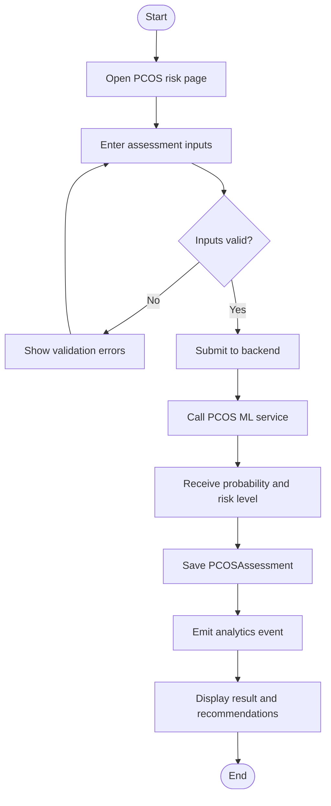
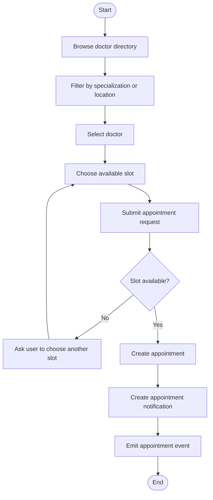
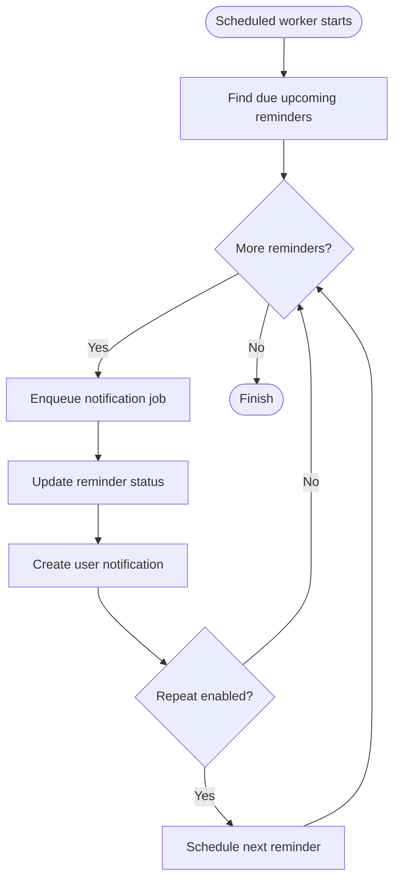
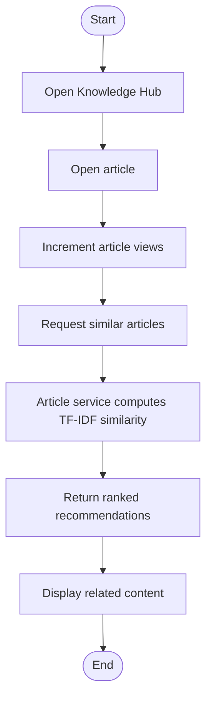

# SheCare Activity Diagrams

## PCOS Risk Assessment

```mermaid
flowchart TD
  start([Start])
  open[Open PCOS risk page]
  input[Enter assessment inputs]
  validate{Inputs valid?}
  fix[Show validation errors]
  api[Submit to backend]
  ml[Call PCOS ML service]
  result[Receive probability and risk level]
  save[Save PCOSAssessment]
  event[Emit analytics event]
  display[Display result and recommendations]
  endNode([End])

  start --> open --> input --> validate
  validate -- No --> fix --> input
  validate -- Yes --> api --> ml --> result --> save --> event --> display --> endNode
```

## Appointment Booking

```mermaid
flowchart TD
  start([Start])
  search[Browse doctor directory]
  filter[Filter by specialization or location]
  select[Select doctor]
  slot[Choose available slot]
  submit[Submit appointment request]
  conflict{Slot available?}
  retry[Ask user to choose another slot]
  create[Create appointment]
  notify[Create appointment notification]
  analytics[Emit appointment event]
  done([End])

  start --> search --> filter --> select --> slot --> submit --> conflict
  conflict -- No --> retry --> slot
  conflict -- Yes --> create --> notify --> analytics --> done
```

## Reminder Processing

```mermaid
flowchart TD
  start([Scheduled worker starts])
  due[Find due upcoming reminders]
  each{More reminders?}
  enqueue[Enqueue notification job]
  mark[Update reminder status]
  notify[Create user notification]
  repeat{Repeat enabled?}
  next[Schedule next reminder]
  finish([Finish])

  start --> due --> each
  each -- Yes --> enqueue --> mark --> notify --> repeat
  repeat -- Yes --> next --> each
  repeat -- No --> each
  each -- No --> finish
```

## Knowledge Hub Recommendation

```mermaid
flowchart TD
  start([Start])
  list[Open Knowledge Hub]
  choose[Open article]
  increment[Increment article views]
  query[Request similar articles]
  vector[Article service computes TF-IDF similarity]
  ranked[Return ranked recommendations]
  display[Display related content]
  endNode([End])

  start --> list --> choose --> increment --> query --> vector --> ranked --> display --> endNode
```

