# SheCare Architecture And Data Flow

This document describes the runtime architecture, major services, persistence layer, asynchronous processing, ML integrations, and key data flows in SheCare.

## System Context

SheCare is a full-stack women's health platform with three main runtime layers:

- **Frontend:** Next.js dashboard and admin portal.
- **Backend:** Express API that owns authentication, authorization, business rules, persistence, caching, background jobs, and event emission.
- **ML services:** FastAPI services for PCOS risk prediction, cycle irregularity support, and article recommendations.

Supporting infrastructure:

- **MongoDB:** primary system of record.
- **Redis:** API caching, rate-limit state, and BullMQ queue storage.
- **BullMQ workers:** reminder and notification background jobs.
- **Kafka:** domain event stream for analytics and audit pipelines.
- **Zookeeper:** Kafka coordination in local Docker Compose.

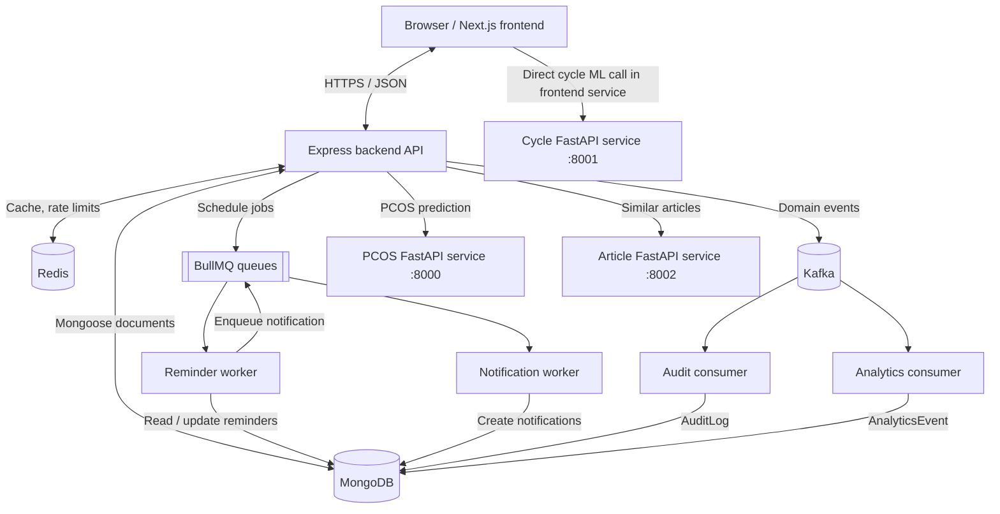

## Application Layers

| Layer | Responsibility | Main paths |
| --- | --- | --- |
| Frontend app | User dashboard, admin portal, forms, client state, API calls | `frontend/src/app`, `frontend/src/services`, `frontend/src/store` |
| Backend routes | HTTP endpoint registration and middleware boundaries | `backend/routes` |
| Backend controllers | Business workflows and response shaping | `backend/controllers` |
| Backend models | MongoDB document schema definitions | `backend/models` |
| Middleware | Auth, admin authorization, rate limiting, errors, uploads | `backend/middleware` |
| Queue producers | Add BullMQ jobs after API writes | `backend/queues/producers` |
| Workers | Process background jobs independently from API requests | `backend/workers` |
| Kafka layer | Produce and consume domain events | `backend/kafka`, `backend/consumers` |
| ML services | Model inference and recommender artifacts | `ml-model/*-service` |

## Backend API Surface

The Express server registers these route groups under `/api`:

| Route prefix | Purpose | Protection |
| --- | --- | --- |
| `/api/auth` | Register, login, refresh, logout, current user | Mixed public/protected |
| `/api/cycles` | Cycle CRUD and cycle analytics | Authenticated |
| `/api/health-logs` | Health log CRUD | Authenticated |
| `/api/reminders` | Reminder CRUD and completion | Authenticated |
| `/api/notifications` | Notification list/read/delete | Authenticated |
| `/api/doctors` | Doctor directory and doctor CRUD | Public reads, protected writes |
| `/api/appointments` | Appointment booking and status changes | Authenticated |
| `/api/reports` | Medical report upload/list/detail/delete | Authenticated |
| `/api/pcos` | PCOS prediction and assessment history | Authenticated |
| `/api/analytics` | User analytics summary | Authenticated |
| `/api/articles` | Knowledge Hub articles and similar articles | Public reads, protected writes |
| `/api/timeline` | User activity timeline from analytics events | Authenticated |
| `/api/admin` | Admin users, doctors, articles, appointments, reports, tools, audit logs | Authenticated admin |

Global backend controls:

- `requestId` middleware attaches request context for error responses.
- JSON payloads are limited by `JSON_BODY_LIMIT` or `1mb`.
- CORS allows configured origins and credentials.
- Helmet sets security headers.
- Morgan logs requests.
- General API rate limiting applies to `/api`.
- ML proxy rate limiting applies to ML-backed routes such as PCOS prediction and similar articles.
- `/health` is a liveness endpoint.
- `/readyz` checks MongoDB and Redis readiness.

## Data Ownership

MongoDB is the source of truth for operational data. The backend owns all writes to the primary domain models.

| Model | Owned data |
| --- | --- |
| `User` | Account identity, role, profile, preferences, active status |
| `Session` | Refresh-token sessions and revocation state |
| `Cycle` | Menstrual cycle records, calculated cycle length, predicted next period |
| `HealthLog` | Daily mood, symptoms, sleep, hydration, pain, stress |
| `Reminder` | Scheduled care reminders and repeat settings |
| `Notification` | User-visible notifications |
| `Doctor` | Doctor profiles, availability, verification |
| `Appointment` | Bookings, status, type, slot, meeting link |
| `Report` | Uploaded medical report metadata |
| `PCOSAssessment` | PCOS form input and ML prediction result |
| `Article` | Knowledge Hub content and search metadata |
| `Prescription` | Medicine instructions tied to user, doctor, and appointment |
| `AuditLog` | Admin and audit events persisted from Kafka |
| `AnalyticsEvent` | Normalized activity events persisted from Kafka |

## Synchronous Request Flow

Most user-facing requests follow this path:

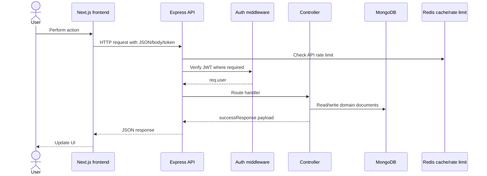

Key characteristics:

- Controllers validate object IDs before document lookups that require IDs.
- User-scoped resources query by both `_id` and `user` to prevent cross-user access.
- Admin routes apply `protect`, `adminOnly`, and admin audit middleware before route handlers.
- Errors are normalized by the shared error handler.

## Authentication And Session Flow

Authentication is JWT-based with stored refresh-token sessions.

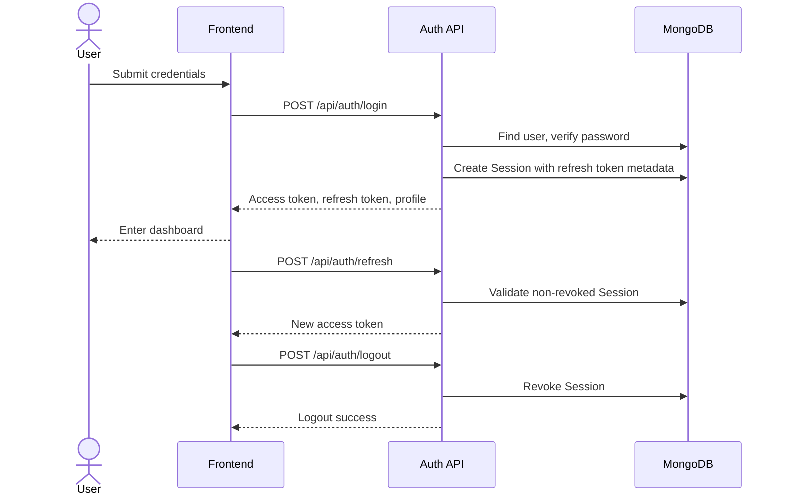

Session records store:

- `user`
- `refreshToken`
- `userAgent`
- `ipAddress`
- `expiresAt`
- `isRevoked`

`expiresAt` has a TTL index, so expired sessions are removed by MongoDB.

## Cycle Tracking Data Flow

Cycle records are calculated server-side from submitted dates and prior user records.

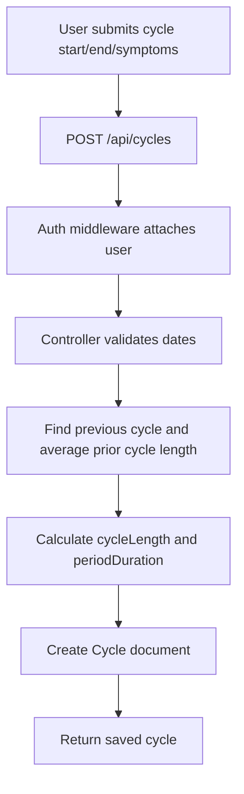

Calculated fields:

- `cycleLength`: difference between this cycle start date and the previous cycle start date; falls back to prior average or `28`.
- `periodDuration`: inclusive number of days between `startDate` and `endDate`.
- `predictedNextPeriod`: exposed in analytics using latest cycle plus average cycle length.

The separate cycle ML service exists under `ml-model/cycle-service`. The frontend has a `cycleMl.service.ts` that can call `NEXT_PUBLIC_CYCLE_ML_API_URL` directly for cycle irregularity prediction. The backend cycle CRUD path currently computes and stores cycle records without proxying through that ML service.

## PCOS Prediction Data Flow

PCOS assessment is a synchronous ML-backed backend flow.

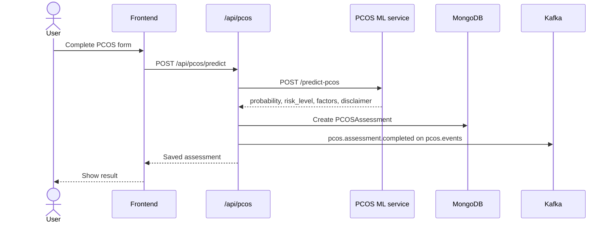

Operational details:

- Backend URL comes from `ML_SERVICE_URL`.
- Backend applies a 15-second ML request timeout.
- If the ML service is unavailable, the backend returns `503`.
- Saved assessments contain both the raw input and prediction result.
- Admin analytics cache is invalidated after a new assessment.
- Kafka emission is fail-open: API success does not depend on Kafka being available.

## Article Recommendation Data Flow

Articles are stored in MongoDB. Similar-article recommendations are generated by the article ML service using TF-IDF and cosine similarity artifacts.

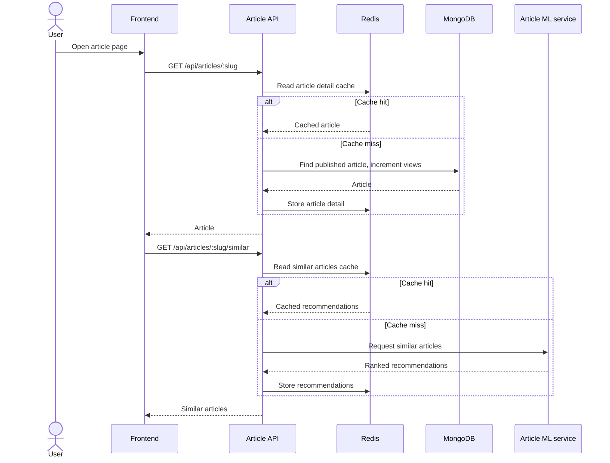

Article search also uses an in-memory trie built on backend startup by `buildArticleTrie()`. Admin tooling can refresh the trie and retrain the recommender.

## Reports And File Upload Flow

Report upload uses the backend upload middleware and stores metadata in MongoDB.

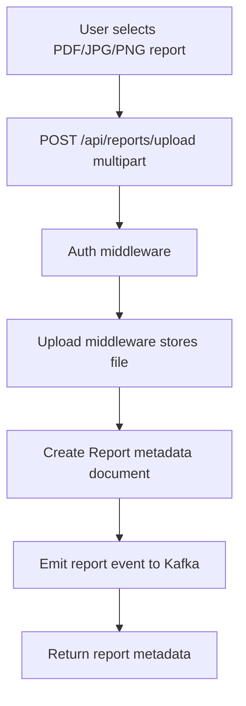

Stored report metadata includes:

- `title`
- `category`
- `doctorName`
- `fileName`
- `originalName`
- `mimeType`
- `size`
- `path`
- `notes`

## Reminder And Notification Queue Flow

Reminders use BullMQ because due reminders should be processed outside the API request lifecycle.

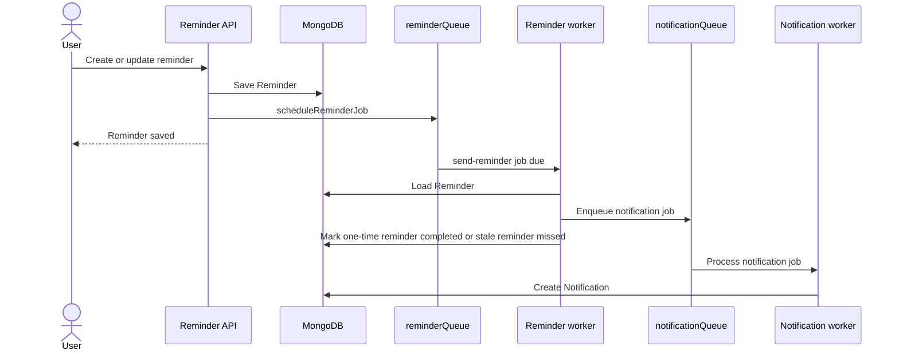

Queue names:

| Queue | Purpose |
| --- | --- |
| `reminderQueue` | Delayed and repeatable reminder jobs |
| `notificationQueue` | User, targeted, and global notification creation |
| `emailQueue` | Reserved for email work |
| `analyticsQueue` | Reserved for analytics queue work |

Redis is required for BullMQ. If queue scheduling fails, reminder and notification-producing endpoints return a clear `503` style error rather than pretending the job was scheduled.

## Kafka Event Flow

Kafka provides durable event streams for analytics and audit. Domain requests remain successful if Kafka emission fails.

```mermaid
flowchart LR
  API[Express API] -->|emitKafkaEventSafely| Kafka[(Kafka)]
  Kafka --> AnalyticsConsumer[Analytics consumer]
  Kafka --> AuditConsumer[Audit consumer]
  AnalyticsConsumer --> AnalyticsEvent[(AnalyticsEvent collection)]
  AuditConsumer --> AuditLog[(AuditLog collection)]
  TimelineAPI[/api/timeline] --> AnalyticsEvent
  AdminAuditAPI[/api/admin/audit-logs] --> AuditLog
```

Topics:

| Topic | Producer examples | Consumer |
| --- | --- | --- |
| `user.events` | Authentication/user lifecycle events | Analytics consumer |
| `appointment.events` | Appointment booking/status events | Analytics consumer |
| `reminder.events` | Reminder create/complete events | Analytics consumer |
| `report.events` | Report upload/delete events | Analytics consumer |
| `pcos.events` | PCOS assessment completed | Analytics consumer |
| `article.events` | Article view/admin article events | Analytics consumer |
| `admin.events` | Admin operational actions | Audit consumer, analytics where relevant |
| `audit.events` | Explicit audit events | Audit consumer |
| `analytics.events` | Reserved analytics event stream | Infrastructure topic |

Consumer behavior:

- `analyticsConsumer.js` subscribes to user, appointment, reminder, report, PCOS, and article topics.
- It maps incoming messages to `AnalyticsEvent`.
- PCOS payloads are sanitized to keep only risk level, confidence, and created timestamp.
- `auditConsumer.js` subscribes to `audit.events` and `admin.events`.
- It maps events to `AuditLog`.
- Malformed messages are skipped and logged.

## Timeline Data Flow

The timeline is not directly written by each controller. It is built from stored analytics events.

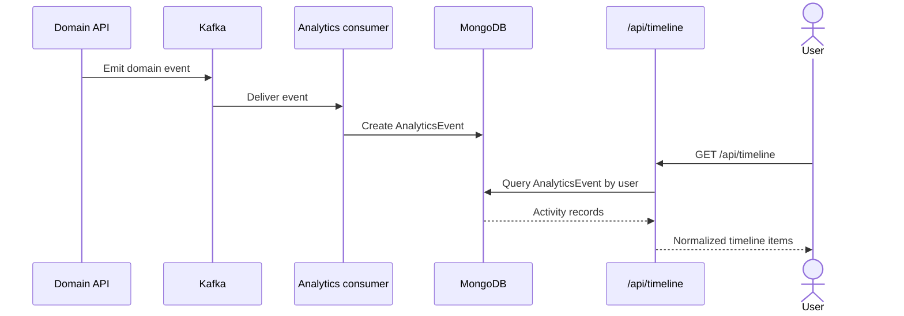

This design keeps user-facing writes fast and lets the timeline expand as more event types are added.

## Admin Data Flow

Admin routes are protected by:

1. `protect`
2. `adminOnly`
3. `auditAdminWrites`

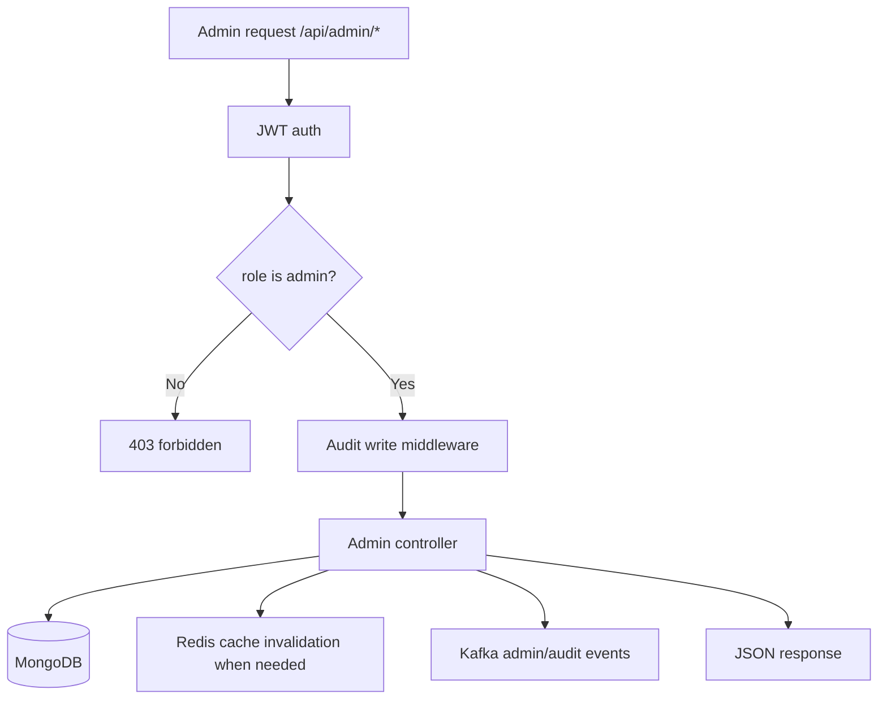

Admin capabilities include:

- System health and tool status checks.
- User role and activation management.
- Session revocation.
- Doctor CRUD and verification.
- Appointment status resolution.
- Article CRUD, publish/unpublish, feature/unfeature, CSV export, trie refresh, recommender retraining.
- Report review/deletion.
- Targeted and global notification creation.
- Audit log review.
- Operational analytics overview.

## Caching Strategy

Redis is used in three ways:

1. **API cache:** read-heavy data such as article lists, article detail, similar articles, admin analytics overview, and doctors.
2. **Rate limiting:** API and ML proxy rate-limit state.
3. **BullMQ storage:** delayed jobs, repeat jobs, retries, and queue metadata.

Cache design principles:

- MongoDB remains the source of truth.
- Caches are invalidated after writes where stale results would be visible.
- Cache failures should degrade behavior rather than corrupt data.
- `/readyz` includes Redis because rate limiting and queues depend on it.

## ML Service Architecture

Each ML service is independently runnable and owns its model artifacts.

| Service | Port | Main endpoint | Artifact examples |
| --- | ---: | --- | --- |
| PCOS service | `8000` | `POST /predict-pcos` | `pcos_random_forest.pkl`, `feature_columns.json`, `model_metrics.json` |
| Cycle service | `8001` | `POST /predict-cycle-irregularity` | `cycle_irregularity_model.pkl`, `feature_columns.json`, `model_metrics.json` |
| Article service | `8002` | Similar article recommendation endpoints | `tfidf_vectorizer.pkl`, `article_vectors.pkl`, `articles_metadata.json` |

ML boundary rules:

- The backend persists model outputs that are part of user history, such as PCOS assessments.
- ML services do not directly write to MongoDB.
- The backend remains the system of record.
- ML failures return controlled errors or fallbacks depending on the route.
- Healthcare predictions include disclaimers and should be treated as decision support, not diagnosis.

## Deployment Topology

Local infrastructure from `docker-compose.yml`:

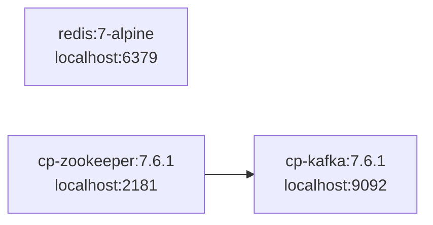

Application processes are expected to run separately:

| Process | Typical command / role |
| --- | --- |
| Frontend | Next.js app serving dashboard/admin UI |
| Backend API | Express server on `PORT`, default `5000` |
| Reminder worker | Processes `reminderQueue` jobs |
| Notification worker | Processes `notificationQueue` jobs |
| Audit consumer | Persists `AuditLog` from Kafka |
| Analytics consumer | Persists `AnalyticsEvent` from Kafka |
| PCOS ML service | FastAPI on `8000` |
| Cycle ML service | FastAPI on `8001` |
| Article ML service | FastAPI on `8002` |

## Environment Variables

Important runtime configuration:

| Variable | Used by | Purpose |
| --- | --- | --- |
| `PORT` | Backend | Express port |
| `MONGO_URI` | Backend, workers, consumers, scripts | MongoDB connection |
| `REDIS_URL` | Backend, workers, queues | Redis connection |
| `JWT_SECRET` | Backend | Access-token signing |
| `JWT_REFRESH_SECRET` | Backend | Refresh-token signing |
| `ML_SERVICE_URL` | Backend PCOS controller | PCOS ML base URL |
| `ARTICLE_ML_SERVICE_URL` | Backend article/admin controllers | Article recommender base URL |
| `PCOS_ML_SERVICE_URL` | Admin tooling status | PCOS service status/config display |
| `CYCLE_ML_SERVICE_URL` | Admin tooling status | Cycle service status/config display |
| `NEXT_PUBLIC_CYCLE_ML_API_URL` | Frontend | Direct cycle ML service URL |
| `KAFKA_BROKER` | Backend Kafka layer | Kafka broker address |
| `CORS_ORIGIN` / allowed origins config | Backend | Browser origin allow-list |

## Failure And Resilience Behavior

| Failure | Expected behavior |
| --- | --- |
| MongoDB unavailable | Startup/readiness fails; API cannot serve data safely |
| Redis unavailable | `/readyz` returns not ready; rate limits/cache/queues fail or degrade |
| Kafka unavailable | API requests continue; `emitKafkaEventSafely` logs warning |
| ML PCOS service unavailable | PCOS prediction returns `503` |
| Article ML service unavailable | Similar article route can use backend fallback behavior where implemented |
| Queue scheduling unavailable | Reminder/notification job endpoints surface queue availability errors |
| Malformed Kafka event | Consumer skips message and logs error |
| Expired session | Mongo TTL removes session; refresh fails |

## End-To-End Data Flow Summary

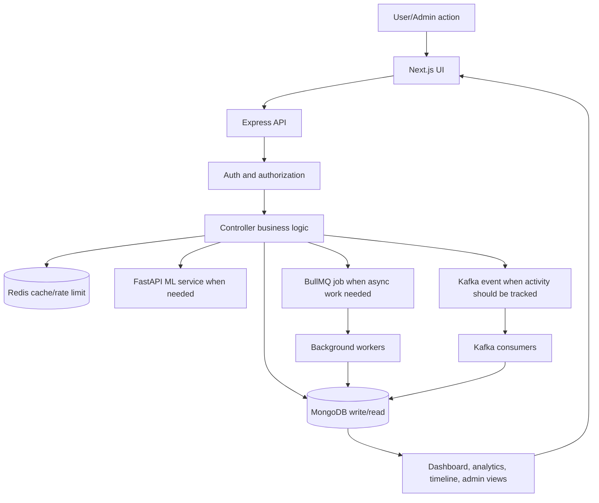

In short: the frontend initiates workflows, the backend enforces ownership and writes canonical records, Redis accelerates and coordinates, BullMQ handles delayed work, Kafka creates durable activity trails, consumers materialize analytics/audit collections, and ML services provide decision-support outputs without becoming the source of truth.

