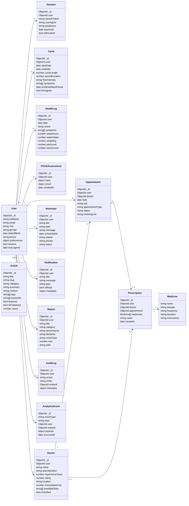

# SheCare Class Diagram

```mermaid
classDiagram
  direction LR

  class User {
    ObjectId _id
    string fullName
    string email
    string role
    string gender
    date dateOfBirth
    string phone
    object preferences
    bool isActive
    date lastLoginAt
  }

  class Session {
    ObjectId _id
    ObjectId user
    string refreshToken
    string userAgent
    string ipAddress
    date expiresAt
    bool isRevoked
  }

  class Cycle {
    ObjectId _id
    ObjectId user
    date startDate
    date endDate
    number cycleLength
    number periodDuration
    string flowIntensity
    string[] symptoms
    date predictedNextPeriod
    bool isIrregular
  }

  class HealthLog {
    ObjectId _id
    ObjectId user
    date date
    string mood
    string[] symptoms
    number sleepHours
    number waterIntake
    number weightKg
    number painLevel
    number stressLevel
  }

  class PCOSAssessment {
    ObjectId _id
    ObjectId user
    object input
    object result
    date createdAt
  }

  class Doctor {
    ObjectId _id
    ObjectId user
    string name
    string specialization
    number experienceYears
    number rating
    string location
    number consultationFee
    string[] availableSlots
    bool isVerified
  }

  class Appointment {
    ObjectId _id
    ObjectId user
    ObjectId doctor
    date date
    string slot
    string appointmentType
    string status
    string meetingLink
  }

  class Prescription {
    ObjectId _id
    ObjectId user
    ObjectId doctor
    ObjectId appointment
    Medicine[] medicines
    string notes
    date issuedAt
  }

  class Medicine {
    string name
    string dosage
    string frequency
    string duration
    string instructions
  }

  class Reminder {
    ObjectId _id
    ObjectId user
    string title
    string type
    string message
    date scheduledAt
    string repeat
    string priority
    string status
  }

  class Notification {
    ObjectId _id
    ObjectId user
    string title
    string message
    string type
    bool isRead
    object metadata
  }

  class Report {
    ObjectId _id
    ObjectId user
    string title
    string category
    string doctorName
    string fileName
    string mimeType
    number size
    string path
  }

  class Article {
    ObjectId _id
    string title
    string slug
    string category
    string summary
    string content
    string[] tags
    string[] keywords
    bool featured
    bool isPublished
    number views
  }

  class AuditLog {
    ObjectId _id
    ObjectId user
    string action
    string entity
    ObjectId entityId
    object metadata
  }

  class AnalyticsEvent {
    ObjectId _id
    string eventType
    string topic
    ObjectId user
    ObjectId entityId
    object payload
    date occurredAt
  }

  User "1" --> "0..*" Session
  User "1" --> "0..*" Cycle
  User "1" --> "0..*" HealthLog
  User "1" --> "0..*" PCOSAssessment
  User "1" --> "0..*" Appointment
  User "1" --> "0..*" Reminder
  User "1" --> "0..*" Notification
  User "1" --> "0..*" Report
  User "1" --> "0..*" AuditLog
  User "1" --> "0..*" AnalyticsEvent
  User "0..1" --> "0..1" Doctor
  Doctor "1" --> "0..*" Appointment
  Appointment "0..1" --> "0..1" Prescription
  Prescription "1" --> "1..*" Medicine
  Doctor "0..1" --> "0..*" Prescription
```

