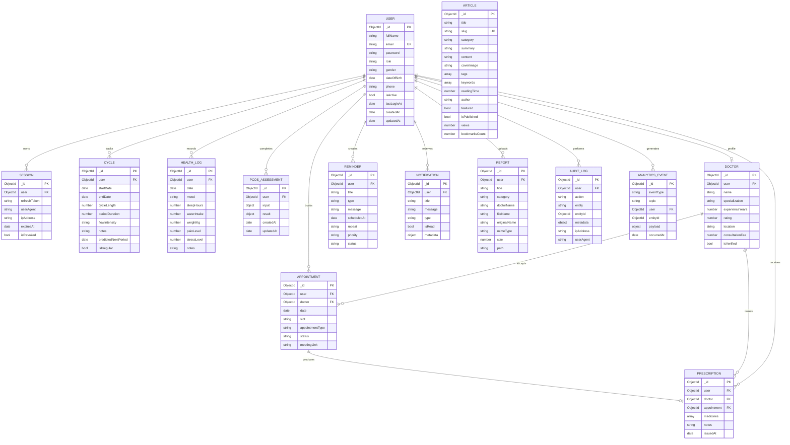

# SheCare Database Schema Diagram

## Important Indexes

| Collection | Indexes |
| --- | --- |
| `users` | `role`, `isActive`, unique `email` |
| `sessions` | `user`, `refreshToken`, TTL `expiresAt` |
| `cycles` | `user + startDate`, `isIrregular` |
| `healthlogs` | `user + date`, `mood` |
| `appointments` | `user + date`, `doctor + date + slot`, `status` |
| `articles` | `category`, `tags`, `keywords`, `featured`, text search |
| `pcosassessments` | `user + createdAt`, `result.risk_level` |
| `reminders` | `user + scheduledAt`, `status`, `type` |
| `notifications` | `user + createdAt`, `user + isRead` |
| `reports` | `user + createdAt`, `category`, `mimeType` |
| `auditlogs` | `user + createdAt`, `entity + entityId`, `action` |
| `analyticsevents` | `eventType`, `topic`, `occurredAt`, `user` |

