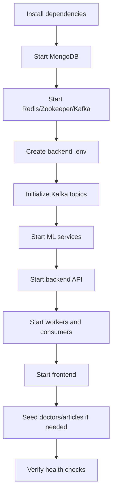

# SheCare Deployment Guide

This guide covers local setup, environment variables, startup order, infrastructure services, health checks, and operational commands.

## Runtime Components

| Component | Technology | Default local address |
| --- | --- | --- |
| Frontend | Next.js | `http://localhost:3000` |
| Backend API | Express / Node.js | `http://localhost:5000` |
| MongoDB | MongoDB | `mongodb://127.0.0.1:27017/shecare` |
| Redis | Redis | `redis://localhost:6379` |
| Zookeeper | Confluent Zookeeper | `localhost:2181` |
| Kafka | Confluent Kafka | `localhost:9092` |
| PCOS ML service | FastAPI | `http://localhost:8000` |
| Cycle ML service | FastAPI | `http://localhost:8001` |
| Article ML service | FastAPI | `http://localhost:8002` |
| Reminder worker | BullMQ worker | Separate Node process |
| Notification worker | BullMQ worker | Separate Node process |
| Audit consumer | Kafka consumer | Separate Node process |
| Analytics consumer | Kafka consumer | Separate Node process |

## Prerequisites

- Node.js `20+`
- npm
- Python `3.10+`
- MongoDB running locally or a managed MongoDB URI
- Docker and Docker Compose for Redis, Zookeeper, and Kafka

## Recommended Local Startup Order



## 1. Install Dependencies

Backend:

```bash
cd backend
npm install
```

Frontend:

```bash
cd frontend
npm install
```

ML services:

```bash
cd ml-model/pcos-service
pip install -r requirements.txt

cd ../cycle-service
pip install -r requirements.txt

cd ../article-service
pip install -r requirements.txt
```

If you use the shared project venv:

```bash
cd ml-model
python3 -m venv .venv
.venv/bin/pip install -r pcos-service/requirements.txt
.venv/bin/pip install -r cycle-service/requirements.txt
.venv/bin/pip install -r article-service/requirements.txt
```

## 2. Start Infrastructure

From the project root:

```bash
docker compose up -d redis zookeeper kafka
```

Check status:

```bash
docker compose ps
```

Tail logs:

```bash
docker compose logs -f redis zookeeper kafka
```

Stop infrastructure:

```bash
docker compose down
```

Redis uses a named volume:

```text
redis_data
```

## 3. Configure Backend Environment

Create `backend/.env`.

Minimum local configuration:

```env
PORT=5000
NODE_ENV=development
MONGO_URI=mongodb://127.0.0.1:27017/shecare
REDIS_URL=redis://localhost:6379

JWT_ACCESS_SECRET=replace_with_local_access_secret
JWT_REFRESH_SECRET=replace_with_local_refresh_secret
ACCESS_TOKEN_EXPIRES_IN=15m
REFRESH_TOKEN_EXPIRES_IN=7d

CLIENT_URL=http://localhost:3000
CLIENT_URLS=http://localhost:3000
TRUST_PROXY=0
JSON_BODY_LIMIT=1mb

ML_SERVICE_URL=http://localhost:8000
ARTICLE_ML_SERVICE_URL=http://localhost:8002
PCOS_ML_SERVICE_URL=http://localhost:8000
CYCLE_ML_SERVICE_URL=http://localhost:8001

KAFKA_CLIENT_ID=shecare-backend
KAFKA_BROKERS=localhost:9092

ALLOW_ADMIN_SEED_TOOLS=false
```

Required by backend environment validation:

| Variable | Required | Purpose |
| --- | --- | --- |
| `MONGO_URI` | Yes | MongoDB connection string |
| `JWT_ACCESS_SECRET` | Yes | Access-token signing secret |
| `JWT_REFRESH_SECRET` | Yes | Refresh-token signing secret |
| `REDIS_URL` | Yes | Redis connection string |
| `KAFKA_BROKERS` | Yes | Kafka broker list |

Production-specific requirements:

- `JWT_ACCESS_SECRET` and `JWT_REFRESH_SECRET` must be real secrets.
- In production, secrets must be at least 32 characters.
- In production, access and refresh secrets must be different.
- In production, configure `CLIENT_URL` or `CLIENT_URLS`.

## 4. Configure Frontend Environment

Create `frontend/.env.local`.

```env
NEXT_PUBLIC_API_URL=http://localhost:5000/api
NEXT_PUBLIC_CYCLE_ML_API_URL=http://localhost:8001
```

The frontend Axios client uses `NEXT_PUBLIC_API_URL` and sends credentials for refresh-token cookie support.

## 5. Initialize Kafka Topics

After Kafka is running:

```bash
cd backend
npm run kafka:init
```

Topics created/used:

- `user.events`
- `appointment.events`
- `reminder.events`
- `report.events`
- `pcos.events`
- `article.events`
- `admin.events`
- `audit.events`
- `analytics.events`

## 6. Start ML Services

Use separate terminals.

PCOS service:

```bash
cd ml-model/pcos-service
uvicorn app.main:app --reload --port 8000
```

Cycle service:

```bash
cd ml-model/cycle-service
uvicorn app.main:app --reload --port 8001
```

Article recommender:

```bash
cd ml-model/article-service
uvicorn app.main:app --reload --port 8002
```

Health checks:

```bash
curl http://localhost:8000/health
curl http://localhost:8001/health
curl http://localhost:8002/health
```

## 7. Start Backend API

Development:

```bash
cd backend
npm run dev
```

Production-style:

```bash
cd backend
npm start
```

Health checks:

```bash
curl http://localhost:5000/health
curl http://localhost:5000/readyz
```

`/health` checks that the process is alive.

`/readyz` checks:

- MongoDB connection
- Redis ping

## 8. Start Workers And Consumers

Run each in its own terminal from `backend/`.

```bash
npm run worker:reminders
npm run worker:notifications
npm run consumer:audit
npm run consumer:analytics
```

Process responsibilities:

| Process | Role |
| --- | --- |
| `worker:reminders` | Processes due reminder jobs and enqueues notification jobs |
| `worker:notifications` | Creates user notifications from queued jobs |
| `consumer:audit` | Persists admin/audit Kafka events into `AuditLog` |
| `consumer:analytics` | Persists domain Kafka events into `AnalyticsEvent` |

## 9. Start Frontend

```bash
cd frontend
npm run dev
```

Open:

```text
http://localhost:3000
```

## 10. Seed Local Data

From `backend/`:

```bash
npm run seed:doctors
npm run seed:articles
```

Admin tool routes can also seed data if enabled and called by an admin, but local scripts are simpler for development.

## Service Dependency Matrix

| Feature | Backend | MongoDB | Redis | Kafka | ML service |
| --- | --- | --- | --- | --- | --- |
| Login/register | Required | Required | Rate limit | Emits events, fail-open | Not required |
| Dashboard data | Required | Required | Cache/rate limit | Not directly required | Not required |
| Cycle tracking | Required | Required | Rate limit | Optional/future events | Cycle ML optional/direct frontend |
| Health logs | Required | Required | Rate limit | Optional/future events | Not required |
| Reminders | Required | Required | Required for jobs | Emits events, fail-open | Not required |
| Notifications | Required | Required | Required for queued notifications | Not required | Not required |
| Appointments | Required | Required | Rate limit/cache | Emits events, fail-open | Not required |
| Reports | Required | Required + filesystem | Rate limit | Emits events, fail-open | Not required |
| PCOS prediction | Required | Required | ML rate limit | Emits events, fail-open | PCOS service required |
| Similar articles | Required | Required | Cache + ML rate limit | Optional article events | Article service preferred |
| Timeline | Required | Required | Rate limit | Analytics consumer required to populate | Not required |
| Admin tools | Required | Required | Cache/queues/rate limit | Audit events, fail-open | Article ML for retraining/status |

## Production Notes

- Run API, workers, consumers, and ML services as separately supervised processes.
- Use managed MongoDB, Redis, and Kafka where possible.
- Set `NODE_ENV=production`.
- Use long random secrets for `JWT_ACCESS_SECRET` and `JWT_REFRESH_SECRET`.
- Configure `TRUST_PROXY` correctly behind a load balancer.
- Configure exact `CLIENT_URL` or `CLIENT_URLS` values.
- Keep uploads on durable storage if reports must survive container restarts.
- Run `npm run kafka:init` during deployment after Kafka is reachable.
- Route traffic only after `/readyz` returns `200`.
- Monitor Kafka consumer lag and worker failures.

## Verification Checklist

```bash
docker compose ps
curl http://localhost:5000/health
curl http://localhost:5000/readyz
curl http://localhost:8000/health
curl http://localhost:8001/health
curl http://localhost:8002/health
```

Backend tests:

```bash
cd backend
npm test
```

Frontend build:

```bash
cd frontend
npm run build
```

ML service tests:

```bash
cd ml-model/cycle-service
../.venv/bin/pytest tests
```

## Troubleshooting

| Symptom | Likely cause | Fix |
| --- | --- | --- |
| `/readyz` returns `503` | MongoDB or Redis unavailable | Start MongoDB/Redis and check env values |
| Auth always fails | Wrong `JWT_ACCESS_SECRET` or missing `Authorization` header | Confirm env and frontend token storage |
| Refresh fails | Refresh token missing, expired, revoked, or secret changed | Log in again; inspect `sessions` collection |
| Reminder creation returns queue error | Redis/BullMQ unavailable | Start Redis and restart backend/workers |
| Timeline is empty | Analytics consumer not running or Kafka unavailable | Start Kafka, run `kafka:init`, start `consumer:analytics` |
| Admin audit logs missing | Audit consumer not running | Start `consumer:audit` |
| PCOS prediction returns `503` | PCOS ML service not running or `ML_SERVICE_URL` wrong | Start service on `8000` and check env |
| Similar articles missing | Article ML service unavailable or artifacts missing | Start article service/retrain recommender |
| CORS blocked | Frontend origin not in `CLIENT_URL`/`CLIENT_URLS` | Add exact origin and restart backend |
| Kafka topic errors | Topics not initialized | Run `npm run kafka:init` |

