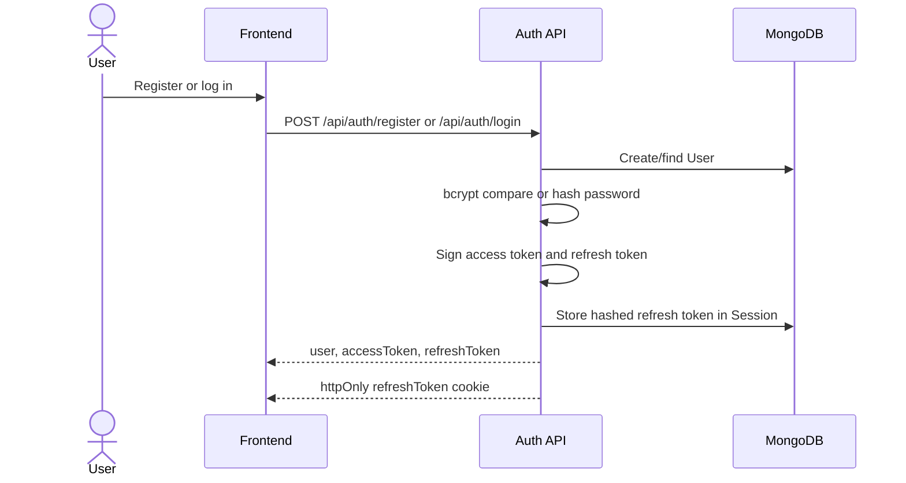
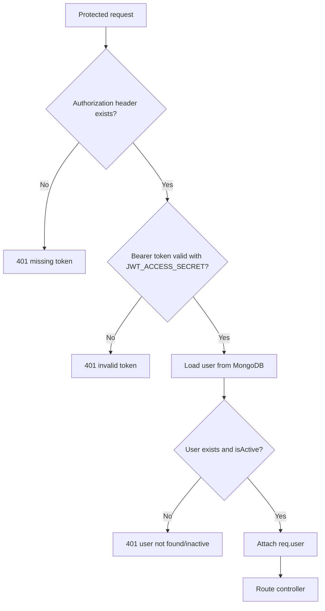
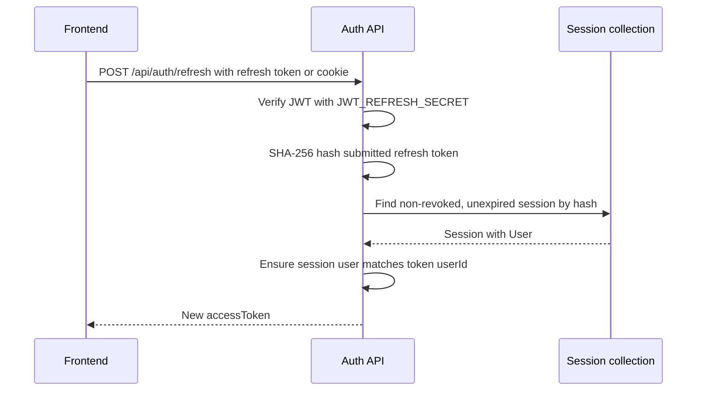

# SheCare Security Architecture

This document summarizes the security controls currently implemented in SheCare: JWT authentication, refresh-token sessions, admin guards, rate limiting, upload validation, CORS, Helmet, and audit logging.

## Security Goals

- Keep user health records scoped to the authenticated owner.
- Separate normal user access from admin operations.
- Avoid storing raw refresh tokens.
- Limit brute-force and high-cost ML requests.
- Validate uploaded report files before storing them.
- Emit audit records for successful admin writes.
- Keep production configuration explicit and fail fast when secrets are missing.

## Authentication Flow



Access token:

- Signed with `JWT_ACCESS_SECRET`.
- Contains `userId` and `role`.
- Default expiry: `15m`.
- Sent by frontend as `Authorization: Bearer <token>`.

Refresh token:

- Signed with `JWT_REFRESH_SECRET`.
- Contains `userId`.
- Default expiry: `7d`.
- Returned in response body and also set as an `httpOnly` cookie.
- Stored in MongoDB only as a SHA-256 hash.

Password storage:

- Passwords are hashed with bcrypt.
- Salt rounds: `10`.
- User password field is excluded from normal selects.

## Request Authorization Flow



Protected middleware:

```text
protect
```

Core checks:

- `Authorization` header must be `Bearer <token>`.
- Token must verify with `JWT_ACCESS_SECRET`.
- Decoded `userId` must match an existing active user.
- `req.user` is attached without the password field.

## Refresh Token Session Security

Refresh flow:



Session security controls:

- Raw refresh tokens are not stored in MongoDB.
- Stored session token value is `sha256(refreshToken)`.
- Sessions include `userAgent`, `ipAddress`, `expiresAt`, and `isRevoked`.
- `expiresAt` has a MongoDB TTL index.
- Logout revokes the matching session.
- Admins can revoke sessions for a user.
- Inactive users cannot refresh tokens.

Cookie controls:

| Option | Value |
| --- | --- |
| `httpOnly` | `true` |
| `secure` | `true` in production |
| `sameSite` | `strict` |
| `expires` | Refresh token expiry |

## Frontend Token Handling

The frontend Axios client:

- Uses `NEXT_PUBLIC_API_URL`, default `http://localhost:5000/api`.
- Sends `withCredentials: true`.
- Adds `Authorization: Bearer <accessToken>` when an access token exists.
- On `401`, calls `/auth/refresh` once per failed request chain.
- Retries the original request after receiving a new access token.
- Calls auth-failure handling if refresh fails.

## Admin Authorization

Admin route middleware order:

```text
protect -> adminOnly -> auditAdminWrites -> admin route handler
```

```mermaid
flowchart TD
  A[/api/admin request] --> B[protect]
  B --> C{Authenticated active user?}
  C -- No --> D[401]
  C -- Yes --> E[adminOnly]
  E --> F{role === admin?}
  F -- No --> G[403 Admin access required]
  F -- Yes --> H[auditAdminWrites]
  H --> I[Controller]
```

Admin write methods:

- `POST`
- `PUT`
- `PATCH`
- `DELETE`

For successful admin writes, `auditAdminWrites`:

- Builds an audit payload.
- Persists an `AuditLog` document.
- Emits an `audit.admin_write` event to Kafka topic `audit.events`.
- Captures path, params, query, IP address, and user agent.

Admin tool routes have an extra in-memory rate limit:

- Window: `60 seconds`
- Limit: `12` requests
- Key: user ID plus path, or IP plus path

## Rate Limiting

SheCare uses `express-rate-limit` with Redis-backed stores outside test mode.

| Limiter | Scope | Window | Limit | Message |
| --- | --- | ---: | ---: | --- |
| General API | `/api/*` | 15 min | 300 | Too many API requests |
| Auth | `/api/auth/*` | 15 min | 10 | Too many authentication requests |
| ML proxy | PCOS prediction and similar articles | 60 min | 30 | Too many ML requests |
| Admin tools | Admin seed/export/retrain/tool routes | 60 sec | 12 | Too many admin tool requests |

Rate-limit behavior:

- Uses standard rate-limit headers.
- Legacy headers are disabled.
- Redis store errors are passed through with `passOnStoreError: true`.
- Rate-limit Redis clients are closed during graceful shutdown.

## Upload Security

Medical report uploads use Multer disk storage.

Upload route:

```text
POST /api/reports/upload
```

Required auth:

```text
Bearer token
```

Allowed file types:

| Type | Allowed values |
| --- | --- |
| MIME types | `application/pdf`, `image/jpeg`, `image/png` |
| Extensions | `.pdf`, `.jpg`, `.jpeg`, `.png` |
| Max size | `5 MB` |

Storage:

```text
backend/uploads/reports
```

Filename strategy:

```text
<timestamp>-<random-number>.<extension>
```

Rejected files:

- Unsupported MIME type.
- Unsupported extension.
- File over size limit.

Security note: validation checks MIME type and extension. For stronger production hardening, add file-signature sniffing, malware scanning, private object storage, and signed download URLs.

## CORS And Browser Security

CORS configuration:

- Allows requests with credentials.
- Allows configured origins only.
- Default local origin: `http://localhost:3000`.
- Additional origins come from `CLIENT_URLS`.
- Production requires `CLIENT_URL` or `CLIENT_URLS`.

Origin parsing:

```text
CLIENT_URL=http://localhost:3000
CLIENT_URLS=https://app.example.com,https://admin.example.com
```

Helmet:

- `x-powered-by` is disabled.
- Helmet security headers are enabled.
- `crossOriginResourcePolicy` is set to `cross-origin`.

Body limits:

- JSON request body limit defaults to `1mb`.
- Can be configured with `JSON_BODY_LIMIT`.

Proxy behavior:

- `trust proxy` is controlled by `TRUST_PROXY`.
- Production default is proxy trust level `1` if not explicitly set.

## Environment Validation

Backend startup fails when required variables are missing:

- `MONGO_URI`
- `JWT_ACCESS_SECRET`
- `JWT_REFRESH_SECRET`
- `REDIS_URL`
- `KAFKA_BROKERS`

Production secret validation:

- JWT secrets cannot start with `your_`.
- JWT secrets must be at least 32 characters.
- Access and refresh secrets must be different.
- Client origin must be configured.

## Data Access Boundaries

User-owned resources are scoped by the authenticated user's ID. Common pattern:

```js
Model.findOne({
  _id: req.params.id,
  user: req.user._id
})
```

This prevents a user from fetching or changing another user's:

- Cycles
- Health logs
- Reminders
- Notifications
- Reports
- PCOS assessments
- Appointments where controller ownership checks apply

Admin routes intentionally bypass normal user ownership boundaries, but only after `adminOnly`.

## Kafka And Audit Security

Kafka event emission is fail-open:

- If Kafka emit fails, the request can still succeed.
- Failures are logged as warnings.
- This prevents user workflows from being blocked by event-stream outages.

Audit persistence:

- Admin write middleware writes directly to MongoDB.
- It also emits an audit Kafka event.
- Audit consumer subscribes to `audit.events` and `admin.events`.

Analytics persistence:

- Analytics consumer subscribes to domain topics.
- PCOS payloads are sanitized before writing to `AnalyticsEvent`.

## Security Control Matrix

| Risk | Current control |
| --- | --- |
| Password disclosure | bcrypt hashing; password excluded from normal selects |
| Access token theft duration | Short-lived access tokens, default `15m` |
| Refresh token database leak | Stored refresh tokens are SHA-256 hashes |
| Unauthorized route access | Bearer-token `protect` middleware |
| Admin route abuse | `adminOnly`, admin audit logs, admin tool rate limits |
| Brute-force login | Auth route rate limit: 10 per 15 minutes |
| API abuse | General API rate limit: 300 per 15 minutes |
| High-cost ML abuse | ML proxy limit: 30 per hour |
| Unsafe report upload | Auth required; MIME/extension allow-list; 5 MB size limit |
| Cross-origin abuse | CORS allow-list with credentials |
| Missing production secrets | Startup environment validation |
| Lost audit events | Direct MongoDB audit write plus Kafka audit event |

## Recommended Future Hardening

- Add password strength validation and breached-password checks.
- Add email verification and password reset flow.
- Rotate refresh tokens on every refresh.
- Store refresh tokens only in httpOnly cookie, not response body, for browser-only clients.
- Add CSRF protection if cookie-based auth becomes the primary auth mechanism.
- Add content security policy tailored to frontend assets.
- Add file-signature validation and malware scanning for reports.
- Move uploads to private object storage with signed URLs.
- Add role/permission granularity beyond `user`, `doctor`, `admin`.
- Add audit log immutability controls for production.
- Add per-user anomaly detection for repeated failed auth or high-risk actions.
- Add field-level encryption for highly sensitive medical details where required.

