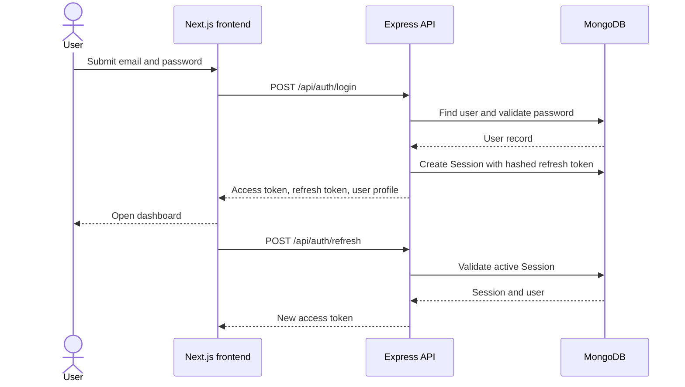
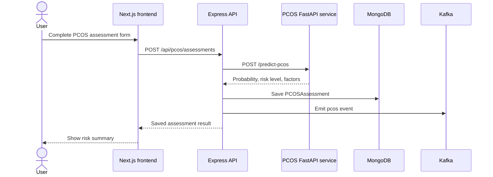
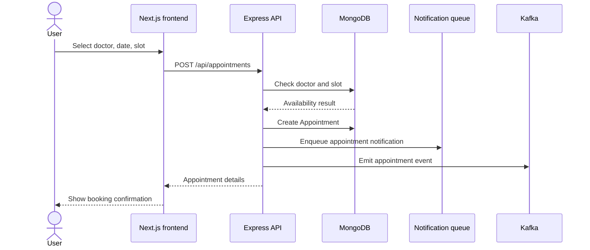
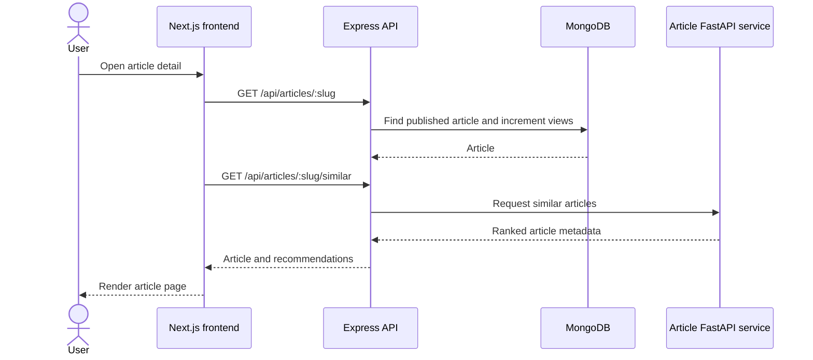

# SheCare Sequence Diagrams

## Login And Session Refresh

```mermaid
sequenceDiagram
  actor User
  participant FE as Next.js frontend
  participant API as Express API
  participant DB as MongoDB

  User->>FE: Submit email and password
  FE->>API: POST /api/auth/login
  API->>DB: Find user and validate password
  DB-->>API: User record
  API->>DB: Create Session with hashed refresh token
  API-->>FE: Access token, refresh token, user profile
  FE-->>User: Open dashboard

  FE->>API: POST /api/auth/refresh
  API->>DB: Validate active Session
  DB-->>API: Session and user
  API-->>FE: New access token
```

## PCOS Prediction

```mermaid
sequenceDiagram
  actor User
  participant FE as Next.js frontend
  participant API as Express API
  participant ML as PCOS FastAPI service
  participant DB as MongoDB
  participant Kafka as Kafka

  User->>FE: Complete PCOS assessment form
  FE->>API: POST /api/pcos/assessments
  API->>ML: POST /predict-pcos
  ML-->>API: Probability, risk level, factors
  API->>DB: Save PCOSAssessment
  API->>Kafka: Emit pcos event
  API-->>FE: Saved assessment result
  FE-->>User: Show risk summary
```

## Book Appointment

```mermaid
sequenceDiagram
  actor User
  participant FE as Next.js frontend
  participant API as Express API
  participant DB as MongoDB
  participant Queue as Notification queue
  participant Kafka as Kafka

  User->>FE: Select doctor, date, slot
  FE->>API: POST /api/appointments
  API->>DB: Check doctor and slot
  DB-->>API: Availability result
  API->>DB: Create Appointment
  API->>Queue: Enqueue appointment notification
  API->>Kafka: Emit appointment event
  API-->>FE: Appointment details
  FE-->>User: Show booking confirmation
```

## Article Recommendations

```mermaid
sequenceDiagram
  actor User
  participant FE as Next.js frontend
  participant API as Express API
  participant DB as MongoDB
  participant ML as Article FastAPI service

  User->>FE: Open article detail
  FE->>API: GET /api/articles/:slug
  API->>DB: Find published article and increment views
  DB-->>API: Article
  FE->>API: GET /api/articles/:slug/similar
  API->>ML: Request similar articles
  ML-->>API: Ranked article metadata
  API-->>FE: Article and recommendations
  FE-->>User: Render article page
```

