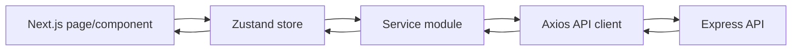
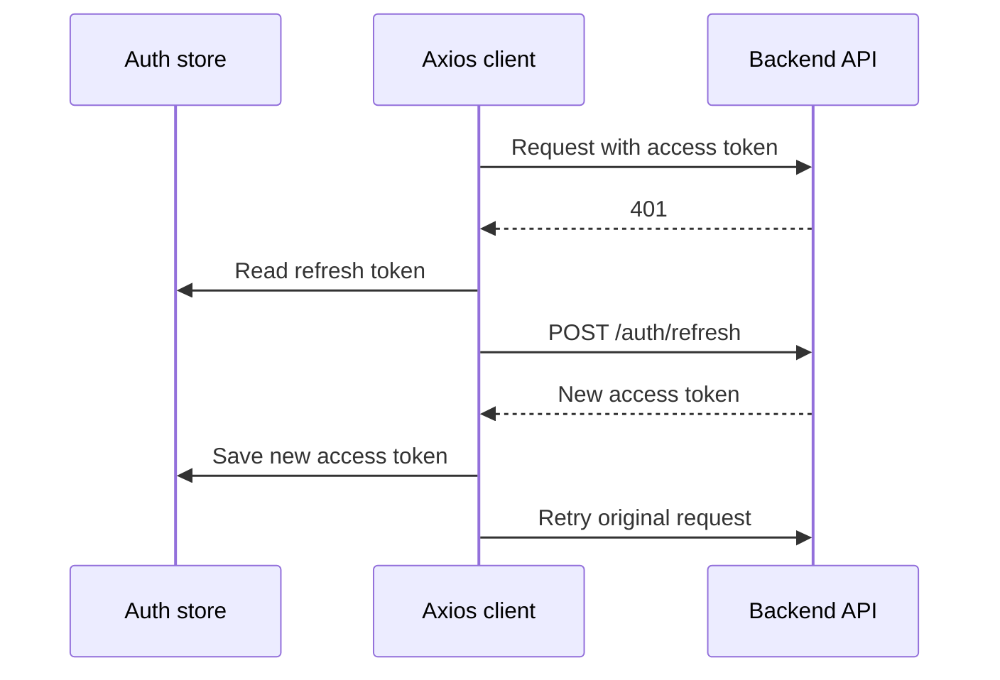
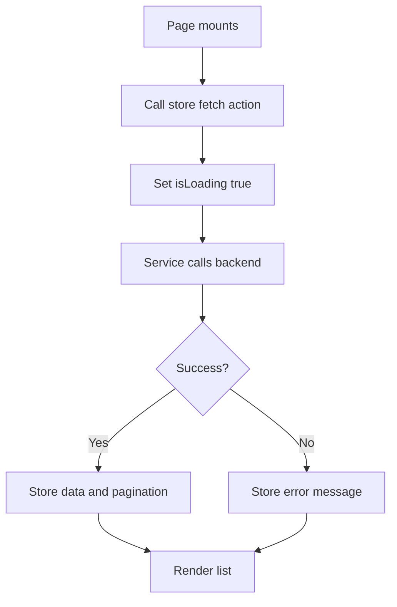
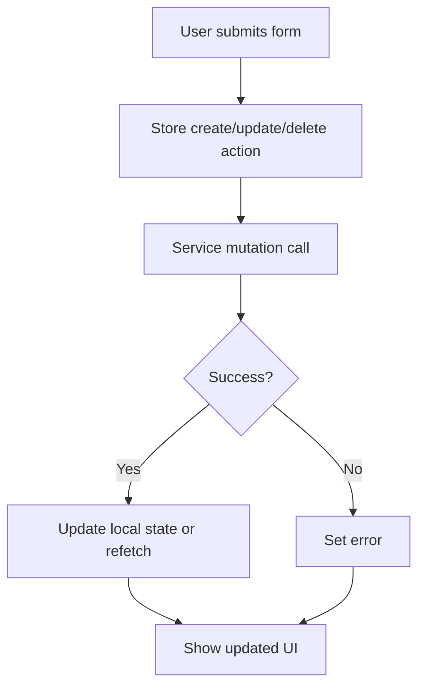

# SheCare State Management And Data Fetching

This document explains how the frontend manages state, talks to the backend, and keeps API boundaries organized.

## Frontend Structure

| Area | Path | Purpose |
| --- | --- | --- |
| App routes | `frontend/src/app` | Next.js pages and layouts |
| Components | `frontend/src/components` | UI building blocks |
| Services | `frontend/src/services` | HTTP API wrappers |
| Stores | `frontend/src/store` | Zustand state containers |
| API client | `frontend/src/lib/api.ts` | Axios instance, auth header, token refresh |
| Types | `frontend/src/types` | Shared TypeScript types |

## Data Flow Pattern



General rule:

- Components should call stores for stateful workflows.
- Stores call services.
- Services call backend endpoints.
- `lib/api.ts` owns auth headers and refresh behavior.

## Axios API Client

File:

```text
frontend/src/lib/api.ts
```

Responsibilities:

- Set base URL from `NEXT_PUBLIC_API_URL`.
- Default to `http://localhost:5000/api`.
- Send `withCredentials: true`.
- Attach bearer access token to requests.
- Refresh access token after `401` responses.
- Retry the original request once after refresh.
- Clear auth state if refresh fails.

Token refresh flow:



## Auth Store

File:

```text
frontend/src/store/authStore.ts
```

Persistence key:

```text
shecare-auth
```

Stored state:

- `user`
- `accessToken`
- `refreshToken`
- `isAuthenticated`

Runtime state:

- `isLoading`
- `error`
- `hasHydrated`

Actions:

- `register`
- `login`
- `logout`
- `fetchMe`
- `setTokens`
- `clearAuth`
- `setHasHydrated`

The auth store configures the Axios interceptors by providing:

- `getAuthTokens`
- `setAuthTokens`
- `handleAuthFailure`

## Service Modules

Service modules translate frontend calls into backend endpoint calls.

| Service | Backend boundary |
| --- | --- |
| `auth.service.ts` | `/auth` |
| `cycle.service.ts` | `/cycles` |
| `healthLog.service.ts` | `/health-logs` |
| `reminder.service.ts` | `/reminders` |
| `notification.service.ts` | `/notifications` |
| `doctor.service.ts` | `/doctors` |
| `appointment.service.ts` | `/appointments` |
| `report.service.ts` | `/reports` |
| `pcos.service.ts` | `/pcos` |
| `analytics.service.ts` | `/analytics` |
| `timeline.service.ts` | `/timeline` |
| `article.service.ts` | `/articles` |
| `cycleMl.service.ts` | Direct cycle ML service |

Admin service modules:

| Service | Backend boundary |
| --- | --- |
| `adminAnalytics.service.ts` | `/admin/analytics` |
| `adminAppointment.service.ts` | `/admin/appointments` |
| `adminArticle.service.ts` | `/admin/articles` |
| `adminAuditLog.service.ts` | `/admin/audit-logs` |
| `adminDoctor.service.ts` | `/admin/doctors` |
| `adminNotification.service.ts` | `/admin/notifications` |
| `adminReport.service.ts` | `/admin/reports` |
| `adminTools.service.ts` | `/admin/tools` |
| `adminUser.service.ts` | `/admin/users` |

## Store Modules

User-facing stores:

| Store | Domain state |
| --- | --- |
| `authStore.ts` | User, tokens, login/logout/register |
| `cycleStore.ts` | Cycle list, cycle analytics, cycle CRUD state |
| `healthLogStore.ts` | Health logs and daily wellness records |
| `reminderStore.ts` | Reminder list and reminder CRUD |
| `notificationStore.ts` | Notification list/read/delete state |
| `appointmentStore.ts` | User appointments |
| `pcosStore.ts` | PCOS prediction and history |
| `analyticsStore.ts` | User analytics summary |
| `reportStore.ts` | Medical report list/upload/delete |

Admin stores:

| Store | Domain state |
| --- | --- |
| `adminAnalyticsStore.ts` | Admin analytics overview |
| `adminAppointmentStore.ts` | Admin appointment management |
| `adminArticleStore.ts` | Admin article CRUD and publishing |
| `adminAuditLogStore.ts` | Audit log list/filter state |
| `adminDoctorStore.ts` | Doctor CRUD and verification |
| `adminNotificationStore.ts` | Admin notifications/announcements |
| `adminReportStore.ts` | Report review/deletion |
| `adminToolsStore.ts` | Seed/export/trie/retrain/status tools |
| `adminUserStore.ts` | User management and session revocation |

## API Boundary Rules

Recommended conventions:

- Stores should not build raw URLs.
- Components should not import `api` directly for domain workflows.
- Services should return `response.data.data` rather than raw Axios responses.
- Stores should handle `isLoading`, `error`, and domain state updates.
- Components should render state and trigger store actions.
- Auth concerns should remain centralized in `authStore` and `lib/api.ts`.

## Protected Route Behavior

Dashboard/admin routes depend on:

- Hydrated auth store.
- Valid authenticated user.
- Role checks for admin routes.

Expected behavior:

| Condition | Result |
| --- | --- |
| Auth store not hydrated | Wait/loading state |
| No access token/user | Redirect to login |
| User role is not admin | Block admin route |
| Token expired | Axios attempts refresh |
| Refresh fails | Clear auth and return to login |

## Data Fetching Lifecycle

Typical list page:



Typical mutation:



## Direct ML Boundary

Most frontend service calls go through the Express API. One exception exists:

```text
frontend/src/services/cycleMl.service.ts
```

This calls:

```text
NEXT_PUBLIC_CYCLE_ML_API_URL
```

Default:

```text
http://localhost:8001
```

Use this direct boundary only for client-side cycle irregularity support. Backend-owned persisted health records should still go through the backend API.

## Known Improvements

- Add service-level tests with mocked Axios.
- Add store tests for loading/error/success transitions.
- Standardize pagination types across all stores.
- Add a query caching layer if server state becomes complex.
- Move direct cycle ML calls behind backend proxy if auth, audit, or persistence is required.
- Add optimistic update patterns only where rollback is safe.

