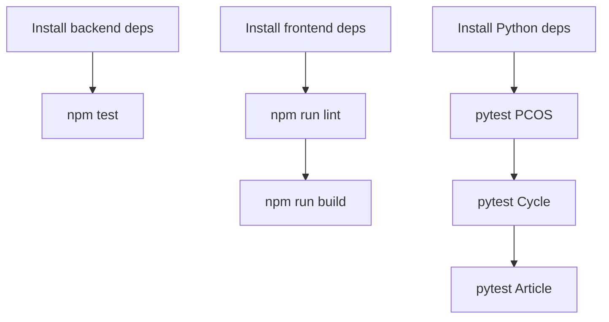

# SheCare Testing Strategy

This document summarizes what is tested, how to run tests, current coverage areas, and known gaps.

## Test Layers

| Layer | Current status | Tools |
| --- | --- | --- |
| Backend API/security | Implemented for admin/security scenarios | Node test runner |
| Frontend | No automated test suite currently present | Build/lint available |
| PCOS ML service | Implemented | Pytest |
| Cycle ML service | Implemented | Pytest |
| Article ML service | Implemented | Pytest |
| End-to-end browser flows | Not currently implemented | Recommended: Playwright |

## Backend Tests

Location:

```text
backend/tests
```

Current files:

| File | Purpose |
| --- | --- |
| `adminHttp.test.js` | HTTP-level admin access checks |
| `adminSecurity.test.js` | Admin router middleware ordering and tool protection |

Run:

```bash
cd backend
npm test
```

What is covered:

- Admin health endpoint rejects missing auth token.
- Admin health endpoint rejects authenticated non-admin users.
- Admin health endpoint allows authenticated admins.
- Admin router applies `protect`, `adminOnly`, and audit middleware before routes.
- Admin tool routes are registered behind the secured admin router.

Known backend gaps:

- Auth register/login/refresh/logout integration tests.
- CRUD tests for cycles, health logs, reminders, reports, appointments, articles.
- Queue behavior tests for reminder and notification jobs.
- Kafka producer/consumer mapping tests beyond current consumer logic assumptions.
- File upload validation tests for supported/unsupported file types.
- Cache invalidation tests.
- Error envelope consistency tests.

## Frontend Checks

Location:

```text
frontend
```

Available commands:

```bash
cd frontend
npm run lint
npm run build
```

What these check:

- TypeScript/Next.js compilation through the build.
- ESLint rules through `npm run lint`.
- Route and component import correctness during build.

Known frontend gaps:

- No component tests.
- No store tests for Zustand state transitions.
- No API client interceptor tests.
- No form validation tests.
- No role-based route guard tests.
- No end-to-end user journeys.

Recommended frontend test additions:

- Unit tests for auth store login/logout/refresh behavior.
- Unit tests for service modules with mocked Axios.
- Component tests for dashboard/admin critical forms.
- Playwright tests for register/login, cycle creation, PCOS assessment, appointment booking, report upload, admin article management.

## PCOS ML Tests

Location:

```text
ml-model/pcos-service/tests
```

Run:

```bash
cd ml-model/pcos-service
pytest tests
```

Or with shared venv:

```bash
cd ml-model/pcos-service
../.venv/bin/pytest tests
```

Current coverage:

- Health endpoint returns expected service response.
- Prediction endpoint accepts valid payload.
- Invalid payload validation is enforced.
- Predictor returns a structured PCOS risk response.
- Fallback behavior is exercised through predictor tests where applicable.

Known gaps:

- Full training pipeline regression tests.
- Feature-order compatibility tests against saved `feature_columns.json`.
- Threshold/risk-level boundary tests.
- Model artifact missing/corrupt behavior tests.
- Calibration and fairness checks.

## Cycle ML Tests

Location:

```text
ml-model/cycle-service/tests
```

Run:

```bash
cd ml-model/cycle-service
pytest tests
```

Or with shared venv:

```bash
cd ml-model/cycle-service
../.venv/bin/pytest tests
```

Current coverage:

| File | Purpose |
| --- | --- |
| `test_api.py` | FastAPI health and prediction endpoint behavior |
| `test_preprocessing.py` | Column normalization, target creation, imputation, encoding, artifact writes |
| `test_train_model.py` | Stratification helper behavior |

Known gaps:

- Full train/evaluate pipeline test with temporary artifacts.
- Challenge-set evaluation test.
- Feature alignment test between training and challenge set.
- Saved model load/predict compatibility test.
- More edge cases around missing categorical values.

## Article ML Tests

Location:

```text
ml-model/article-service/tests
```

Run:

```bash
cd ml-model/article-service
pytest tests
```

Or with shared venv:

```bash
cd ml-model/article-service
../.venv/bin/pytest tests
```

Current coverage:

- Article API health behavior.
- Recommendation API behavior.
- Expected handling of available/missing recommendation artifacts.

Known gaps:

- Training pipeline tests for TF-IDF artifact creation.
- CSV validation edge cases.
- Similarity ranking regression tests with known fixtures.
- Recommender retraining endpoint integration test.

## Manual Smoke Test Checklist

Use this when validating a local demo:

1. Start infrastructure: Redis, Zookeeper, Kafka, MongoDB.
2. Start ML services on ports `8000`, `8001`, `8002`.
3. Start backend API and verify `/health` and `/readyz`.
4. Start workers and Kafka consumers.
5. Start frontend.
6. Register a user.
7. Log in and verify dashboard loads.
8. Create a cycle record.
9. Create a health log.
10. Create a reminder and verify notification behavior.
11. Browse doctors and book an appointment.
12. Upload a report.
13. Run a PCOS assessment.
14. Open Knowledge Hub and similar articles.
15. Open analytics and timeline.
16. Log in as admin and verify admin dashboard.
17. Check admin users/doctors/articles/reports/audit logs.

## CI Recommendation

Recommended pipeline:



Minimum required checks before merging:

- Backend tests pass.
- Frontend build passes.
- ML service tests pass.
- No generated model artifacts unintentionally changed unless the PR is ML-related.

## Test Data Strategy

Recommended approach:

- Keep small deterministic fixtures for unit tests.
- Use temporary directories for model artifact tests.
- Avoid writing tests against live production-like user data.
- Mock external ML services in backend controller tests.
- Mock Kafka and Redis for fast unit tests.
- Use Docker services only in integration tests.

