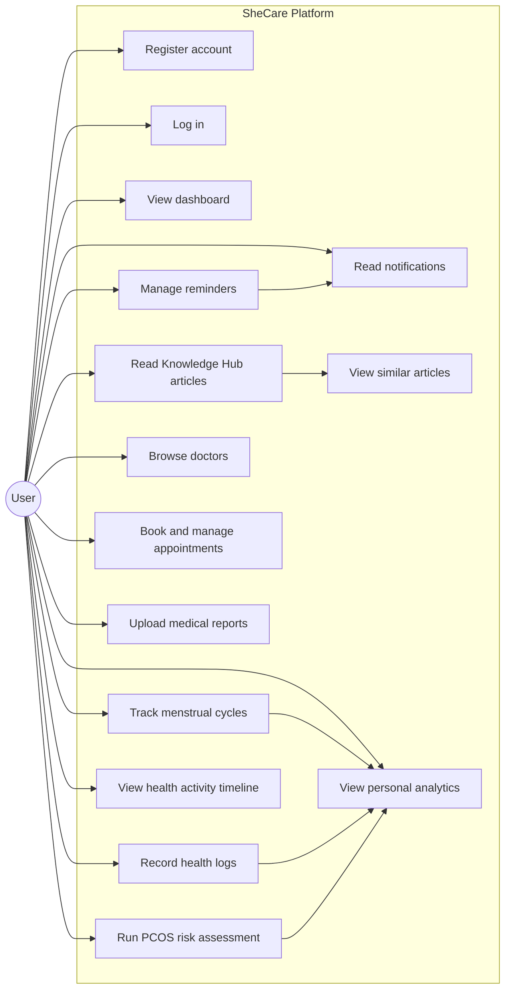
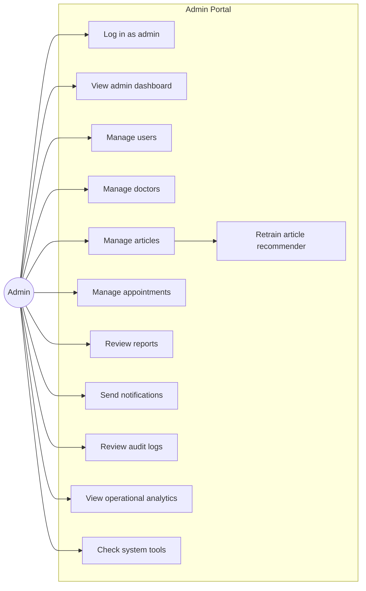
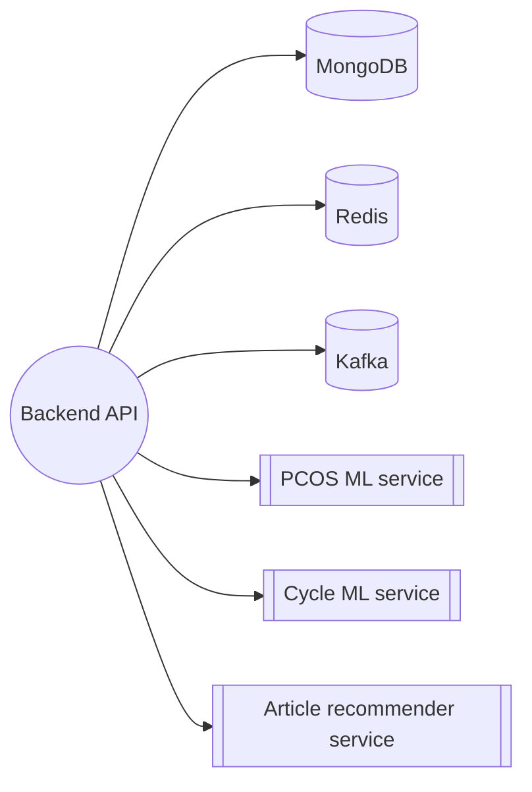

# SheCare Use Case Diagrams

## User Workspace

```mermaid
flowchart LR
  user((User))

  subgraph SheCare["SheCare Platform"]
    register[Register account]
    login[Log in]
    dashboard[View dashboard]
    cycle[Track menstrual cycles]
    logs[Record health logs]
    reminders[Manage reminders]
    notifications[Read notifications]
    doctors[Browse doctors]
    appointments[Book and manage appointments]
    reports[Upload medical reports]
    pcos[Run PCOS risk assessment]
    articles[Read Knowledge Hub articles]
    similar[View similar articles]
    analytics[View personal analytics]
    timeline[View health activity timeline]
  end

  user --> register
  user --> login
  user --> dashboard
  user --> cycle
  user --> logs
  user --> reminders
  user --> notifications
  user --> doctors
  user --> appointments
  user --> reports
  user --> pcos
  user --> articles
  user --> analytics
  user --> timeline

  articles --> similar
  cycle --> analytics
  logs --> analytics
  pcos --> analytics
  reminders --> notifications
```

## Admin Workspace

```mermaid
flowchart LR
  admin((Admin))

  subgraph AdminPortal["Admin Portal"]
    adminLogin[Log in as admin]
    adminDash[View admin dashboard]
    users[Manage users]
    doctors[Manage doctors]
    articles[Manage articles]
    retrain[Retrain article recommender]
    appointments[Manage appointments]
    reports[Review reports]
    announcements[Send notifications]
    audit[Review audit logs]
    analytics[View operational analytics]
    tools[Check system tools]
  end

  admin --> adminLogin
  admin --> adminDash
  admin --> users
  admin --> doctors
  admin --> articles
  admin --> appointments
  admin --> reports
  admin --> announcements
  admin --> audit
  admin --> analytics
  admin --> tools
  articles --> retrain
```

## External Services

```mermaid
flowchart LR
  backend((Backend API))
  mongo[(MongoDB)]
  redis[(Redis)]
  kafka[(Kafka)]
  pcosMl[[PCOS ML service]]
  cycleMl[[Cycle ML service]]
  articleMl[[Article recommender service]]

  backend --> mongo
  backend --> redis
  backend --> kafka
  backend --> pcosMl
  backend --> cycleMl
  backend --> articleMl
```

