# SheCare User Journey Documentation

This document describes key user and admin workflows from login to outcomes.

## Actors

| Actor | Goals |
| --- | --- |
| User | Track health, manage cycles, receive reminders, book doctors, upload reports, read articles, view analytics |
| Doctor | Maintain doctor profile and manage appointment-related work where role support exists |
| Admin | Manage users, doctors, articles, appointments, reports, notifications, audit logs, and operations |
| Background worker | Process reminders and notifications |
| Kafka consumer | Materialize analytics and audit trails |

## User Journey: Account Creation To Dashboard

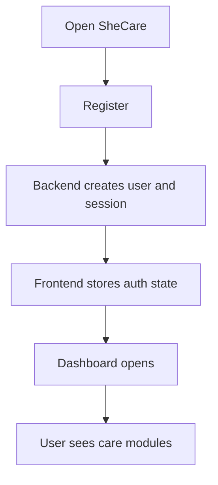

Steps:

1. User opens the frontend.
2. User registers with full name, email, password, and role.
3. Backend hashes password, creates `User`, signs access and refresh tokens, creates `Session`.
4. Frontend stores auth state in `shecare-auth` local storage.
5. User lands in dashboard and can access protected care features.

Outcome:

- Authenticated user session.
- User can create personal health records.

## User Journey: Login And Session Refresh

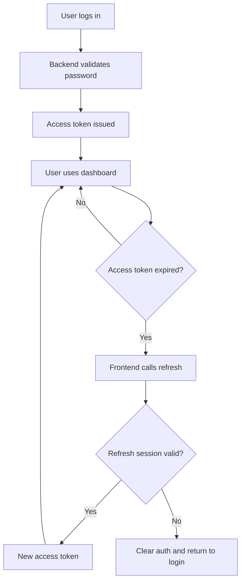

Outcome:

- Smooth dashboard usage while refresh session is valid.
- Failed refresh clears auth and protects private data.

## User Journey: Cycle Tracking

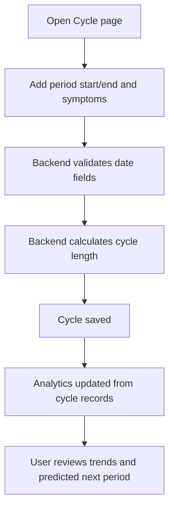

User outcome:

- Period/cycle history is stored.
- Cycle trends and predicted next period become available.
- Irregular cycle count can be shown in analytics.

## User Journey: Daily Health Logging

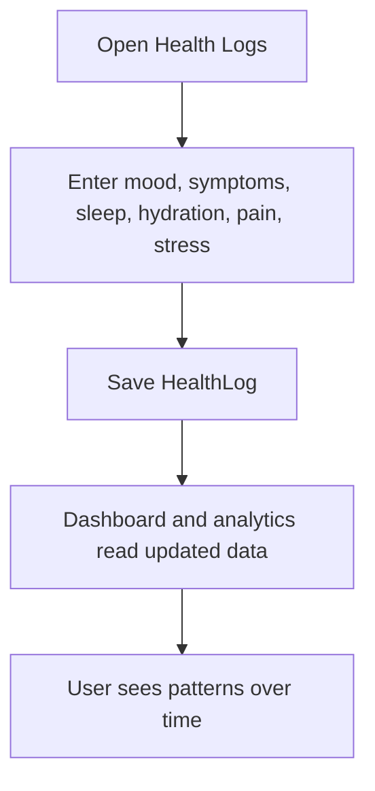

User outcome:

- Daily wellness context is captured.
- Analytics can summarize sleep, hydration, pain, stress, and symptoms.

## User Journey: Reminder To Notification

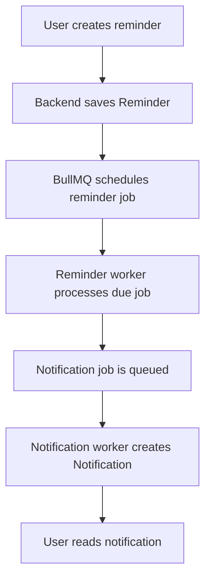

User outcome:

- Medicine, cycle, appointment, or custom reminders trigger notifications.
- One-time reminders can be completed; repeat reminders can continue.

## User Journey: Doctor Booking

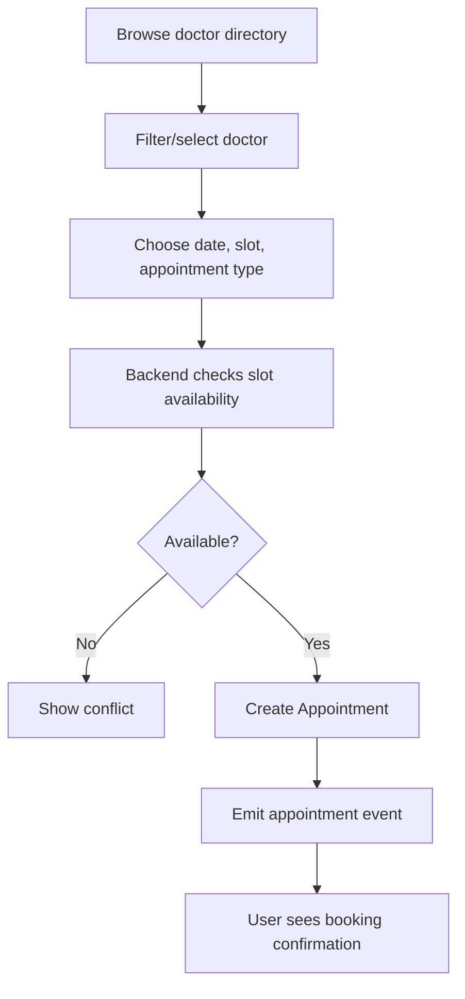

User outcome:

- Appointment is created with doctor/date/slot/status.
- Appointment appears in user appointment history.

## User Journey: Report Upload

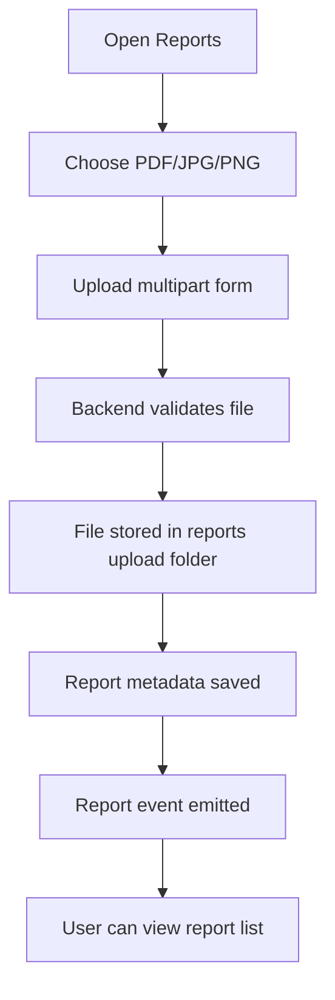

User outcome:

- Report metadata is stored with the user account.
- User can organize medical documents.

## User Journey: PCOS Risk Assessment

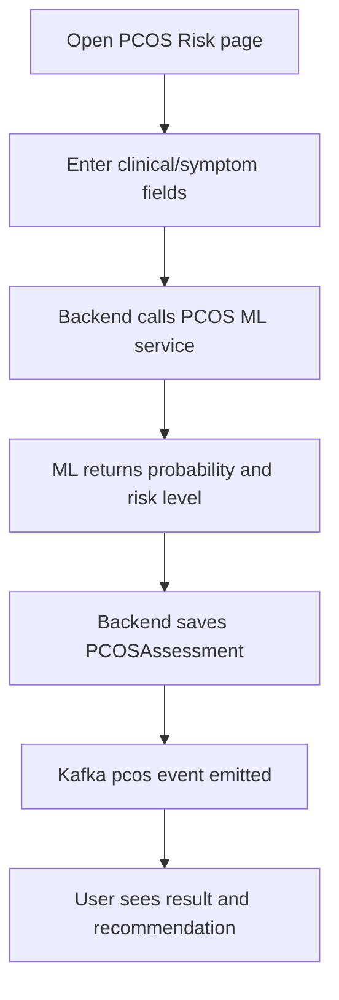

User outcome:

- PCOS assessment history is saved.
- Result includes probability, risk level, contributing factors, recommendation, and disclaimer.

Safety note:

- The result is informational support, not medical diagnosis.

## User Journey: Knowledge Hub

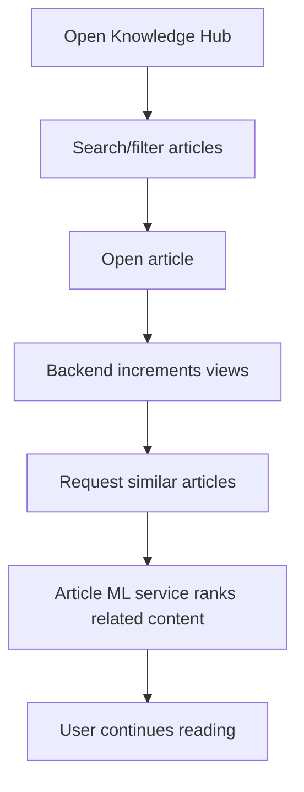

User outcome:

- User receives educational content.
- Similar article recommendations help continue learning.

## User Journey: Analytics And Timeline

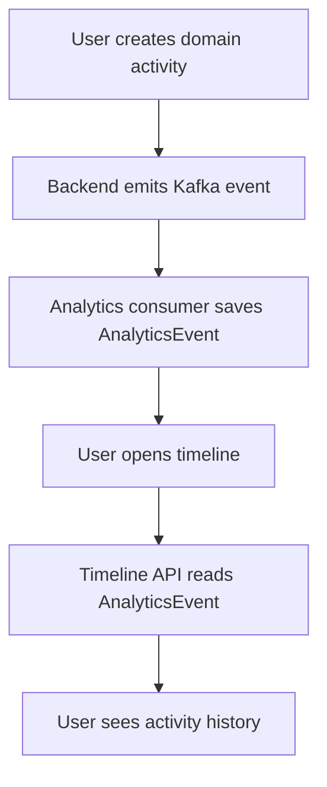

User outcome:

- User sees health activity over time.
- Analytics summarizes health, cycle, reminder, appointment, and PCOS patterns.

## Admin Journey: Admin Login To Operations

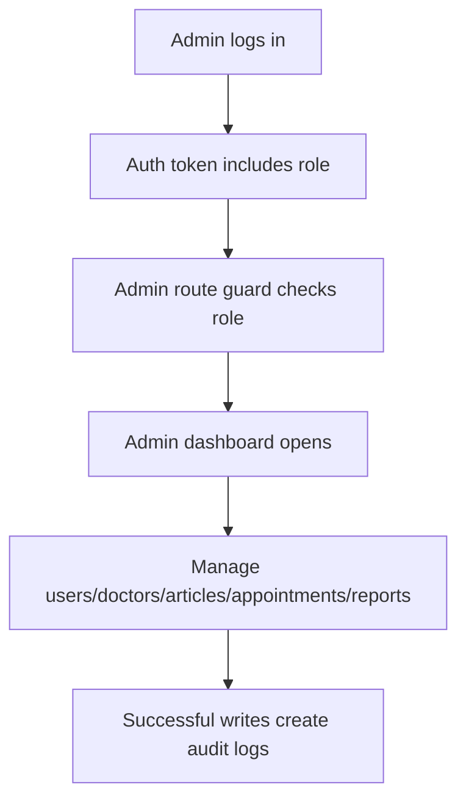

Admin outcome:

- Admin can operate the platform.
- Successful writes are audit logged.

## Admin Journey: User Management

Steps:

1. Admin opens `/admin/users`.
2. Admin searches or filters users.
3. Admin views user detail.
4. Admin changes role, activates/deactivates account, revokes sessions, or deletes user.
5. Backend writes admin audit log.

Outcome:

- User lifecycle and access control can be managed centrally.

## Admin Journey: Article Management

Steps:

1. Admin opens `/admin/articles`.
2. Admin creates or edits article content.
3. Admin publishes/unpublishes or features/unfeatures articles.
4. Admin refreshes search trie or retrains recommender when content changes.
5. Backend invalidates article caches and emits article/admin events.

Outcome:

- Knowledge Hub stays curated and searchable.
- Recommendations can be retrained from current content.

## Admin Journey: Operations And Audit

Steps:

1. Admin opens tools/status.
2. Admin verifies MongoDB counts and ML service configuration.
3. Admin reviews audit logs.
4. Admin reviews analytics overview.
5. Admin sends global or targeted notifications if needed.

Outcome:

- Admin can monitor and operate SheCare without direct database access.

