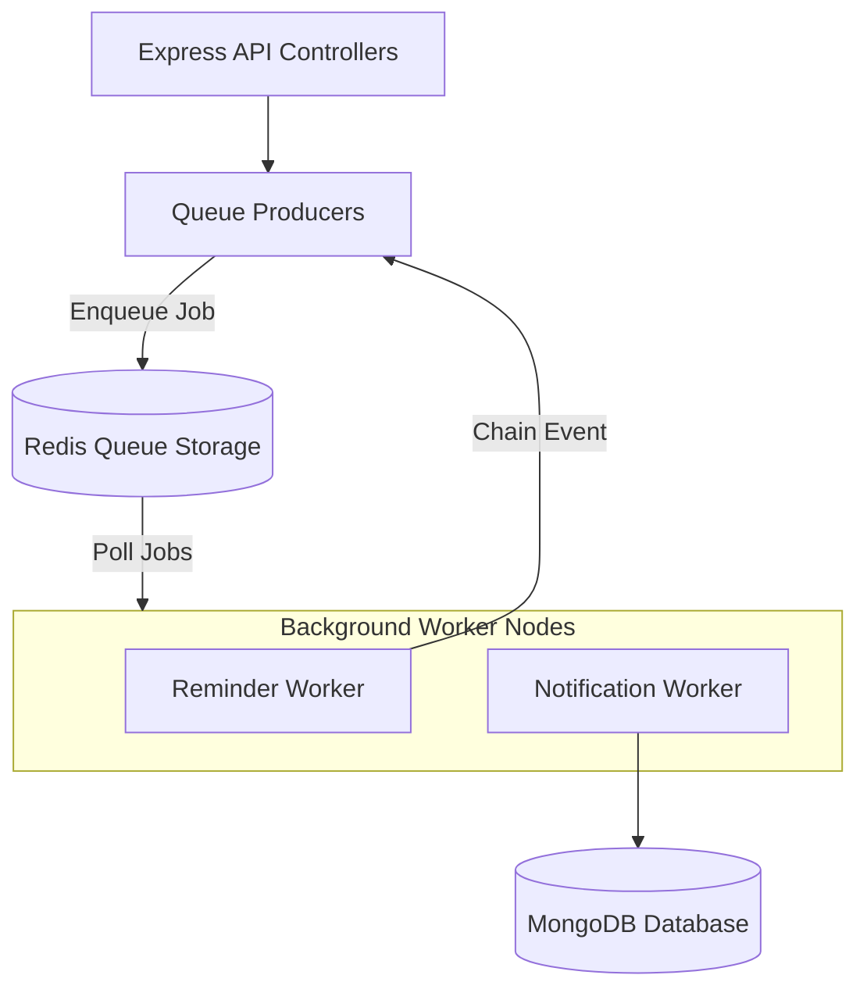

# BullMQ Implementation in SheCare

SheCare utilizes **BullMQ** as its message queuing and background job processing system, backed by Redis. This allows the application to handle time-delayed reminders, batch notifications, and email processing asynchronously outside the main API thread.

---

## 1. Core Architecture

BullMQ utilizes Redis to store jobs, manage message locks, and coordinate task distribution across worker processes.

---

## 2. Queue Configuration (`queues/index.js`)

Queues are initialized in [index.js](file:///home/user/Desktop/SheCare/backend/queues/index.js) with standard connection reuse policies and robust retry strategies.

### A. Queue Names (`queueNames.js`)
- `reminderQueue`: Schedules cycle tracking and check-in reminders.
- `notificationQueue`: Manages single, multiple-target, or system-wide announcements.
- `emailQueue`: (Future) Decouples email sending operations.
- `analyticsQueue`: (Future) Queues complex, non-real-time metrics calculations.

### B. Default Job Options
To ensure reliability and prevent memory leaks in Redis, all queues share a `defaultJobOptions` configuration:
- **Attempts**: 3. If a worker encounters an error during execution, the job is retried up to 3 times.
- **Backoff**: Exponential backoff starting at `1000` milliseconds.
- **On Success**: `removeOnComplete: true`. Successful jobs are immediately deleted to keep Redis memory lightweight.
- **On Failure**: `removeOnFail: false`. Failed jobs are preserved in Redis for diagnostic inspection.

---

## 3. Reminder Scheduling System (`reminderProducer.js` & `reminderWorker.js`)

Reminders (medication timings, cycle alerts) use dynamic time delays and repeatable patterns.

- **Delay Computation**: Calculates the difference between `reminder.scheduledAt` and `Date.now()`. If scheduled in the future, it assigns it as a delayed job.
- **Repeat Patterns**: If a reminder repeats (e.g. daily, weekly, monthly), it maps the schedules into standard cron expressions:
  - Daily: `minute hour * * *`
  - Weekly: `minute hour * * day_of_week`
  - Monthly: `minute hour day_of_month * *`
- **Grace Period Protection**: The worker defines `MISSED_GRACE_MS = 3600000` (1 hour). If a one-time reminder job wakes up but was scheduled more than 1 hour in the past (e.g., due to system downtime), it is marked as `missed` in MongoDB and skipped rather than firing late.
- **Delegation**: If a reminder is active and timely, it triggers `enqueueReminderNotification`, placing a corresponding job in the `notificationQueue`.

---

## 4. Notification Dispatch System (`notificationProducer.js` & `notificationWorker.js`)

Notifications support three distinct delivery modes inside `createTargetedNotifications`:
1. **Single User**: Dispatches an alert to a specific user and logs a single document in MongoDB.
2. **Targeted Users** (`users`): Loops through an array of validated user IDs, querying active records, and batches their notifications.
3. **Global Announcement** (`global`): Queries all active profiles in the database and creates notification documents.
   - **Batching**: To protect database memory during massive global dispatches, the worker partitions notification objects into batches of `500` (`INSERT_BATCH_SIZE = 500`) and calls MongoDB `insertMany(batch, { ordered: false })`.

---

## 5. Connection and Lifecycle Management

- **Shared Client Connection** (`queues/connection.js`): Reuses the core Redis client config, duplicating it with `maxRetriesPerRequest: null` (required by BullMQ's queue design).
- **Graceful Worker Shutdown**: Workers listen for `SIGINT` and `SIGTERM` signals. Upon intercept, they execute `worker.close()`, wait for ongoing job runs to finalize, and cleanly close Redis connection pools to prevent orphaned locks.
