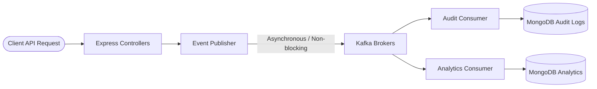

# Kafka Implementation in SheCare

SheCare uses **Apache Kafka** as an asynchronous event streaming platform to decouple write-heavy event tracks from primary API responses. This document outlines how Kafka is integrated, configured, and utilized across the backend system.

---

## 1. Core Architecture

Kafka in SheCare is utilized for asynchronous tasks like **Audit Logging** and **Analytics Processing**. The flow is designed to be **non-blocking**; if the Kafka brokers are offline or unreachable, the API endpoints log warnings but continue to return successful HTTP responses (fail-safe).

---

## 2. Event Topics Configuration

All Kafka topics are centralized inside [topics.js](file:///home/user/Desktop/SheCare/backend/kafka/topics.js). The defined topics and their mapping names are:

| Topic Constant | Topic Name (Kafka Broker) | Description |
| :--- | :--- | :--- |
| `USER_EVENTS` | `user.events` | Events relating to user registrations, profile updates, and authentication. |
| `APPOINTMENT_EVENTS` | `appointment.events` | Doctor bookings, rescheduling, and status changes. |
| `REMINDER_EVENTS` | `reminder.events` | Logs relating to cycle and medication reminders. |
| `REPORT_EVENTS` | `report.events` | Diagnostic report generation, upload, and sharing events. |
| `PCOS_EVENTS` | `pcos.events` | PCOS assessment submission and risk rating events. |
| `ARTICLE_EVENTS` | `article.events` | Article creation, bookmarking, and views. |
| `ADMIN_EVENTS` | `admin.events` | Administrative actions and back-office alterations. |
| `AUDIT_EVENTS` | `audit.events` | Standard audit log inputs for compliance tracking. |
| `ANALYTICS_EVENTS` | `analytics.events` | Consolidated system metrics and telemetry. |

---

## 3. Producer and Event Publisher

- **Client Setup**: In [client.js](file:///home/user/Desktop/SheCare/backend/kafka/client.js), SheCare initializes the `kafkajs` library client. Connection settings like brokers (`KAFKA_BROKERS`), request timeouts, and retries are read from the environment config.
- **Producer Connection**: Managed inside [producer.js](file:///home/user/Desktop/SheCare/backend/kafka/producer.js), which exports a single, globally shared producer connection. The producer connects when the Express server starts up and gracefully disconnects during server shutdown.
- **Fail-Safe Event Publisher**: Implemented in [eventPublisher.js](file:///home/user/Desktop/SheCare/backend/kafka/eventPublisher.js), `emitKafkaEventSafely(topic, payload)` wraps the producer emit function in a `try-catch` block. It fires-and-forget; if the broker is unavailable, it logs a warning: `Kafka event emit failed` but does **not** throw or block the API response.

---

## 4. Consumer Architecture

Consumers are decoupled processes running in the background. They connect to the Kafka broker, subscribe to specified topics, and process messages inside consumer groups.

### A. Audit Consumer (`consumers/auditConsumer.js`)
- **Subscriptions**: Subscribes to `audit.events` and `admin.events`.
- **Purpose**: Processes events related to administrative operations or high-compliance actions (e.g. data downloads, user deletions) and saves a permanent record to the `AuditLog` collection in MongoDB.

### B. Analytics Consumer (`consumers/analyticsConsumer.js`)
- **Subscriptions**: Subscribes to `user.events`, `appointment.events`, `reminder.events`, `report.events`, `pcos.events`, and `article.events`.
- **Purpose**: Consumes domain events, extracts telemetry data, and increments or updates analytics collections in MongoDB (such as active appointments, average PCOS risks, etc.) to populate the admin dashboards.

---

## 5. Graceful Shutdown & Initialization

- **Initialization**: The server setup features a bootstrap script `npm run kafka:init` ([initTopics.js](file:///home/user/Desktop/SheCare/backend/kafka/initTopics.js)) that connects via the Kafka Admin client, checks topic existence, and pre-creates any missing topics with default partition settings.
- **Clean Disposal**: During `SIGINT` or `SIGTERM` signals, the Express server and consumer processes catch the event and cleanly close connection loops to prevent rebalance penalties or message losses.
